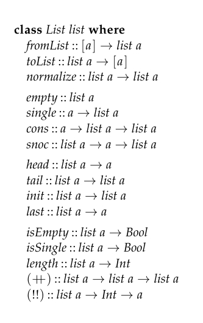

# lecture1
this lecture would remind us about haskell, lazy/strict evaluation

```haskell
module Intro where
```

goals of the course:

- explore different paradigms
- algorithmic thinking
- analyse performance
- mathematical modeling

```haskell
insert :: Ord a => a -> [a] -> [a]
insert x [] = [x]
insert x (y:ys) = 
  | x <= y    = x : y : ys
  | otherwise = y : insert x ys 
```

let T_insert(n) stand for the time needed to insert n

then

- T_insert(0) = 1
- T_insert(n) = 1 + T_insert(n-1)

so T_insert(n) = n + 1, it is O(n) in time, the list is O(n) in space

```haskell
isort :: Ord a => [a] => [a]
isort [] = []
isort (x:xs) = insert x (isort xs)
-- we first want xs to be sorted, so isort xs
-- we want to insert x to the sorted xs, so insert x (isort xs)
```

- T_isort(0) = 1
- T_isort(n) = 1 + T_insert(n-1) + T_isort(n-1)

so 

$\begin{aligned}
\text{T_isort}(n) &= 1 + \text{T_insert}(n-1) + \text{T_isort}(n-1)\\
&=1 + n + \text{T_isort}(n-1)\\
&= 1+n+(1+n-1) + \text{T_isort}(n-2)\\
&=n + \sum_{i=1}^{n}i\\
&=O(n^2)\end{aligned}$

we create two further functions

```haskell
head :: [a] -> a
head (x:_) = x
```

```haskell
minimum :: Ord a => [a] -> a
minimum xs = head(isort xs)
-- isort sorts the list, the head is the minimum
```

so

```haskell
minimum [3,5,2,1] = head (isort [3,5,2,1])
                  = head (insert 3 (isort [5,2,1]))
                  = head (insert 3 (insert 5 (isort [2,1])))
                  = head (insert 3 (insert 5 (insert 2 (isort [1]))))
                  = head (insert 3 (insert 5 (insert 2 (insert 1 []))))
                  = head (insert 3 (insert 5 (insert 2 (1 : ?))))
                  = head (insert 3 (insert 5 ((1 : ?))))
                  = head (insert 3 (((1 : ?))))
                  = head ((((1 : ?))))
                  = 1
```

minimum looked like $O(n^2)$ but it is $O(n)$

if haskell is a strict language, then minimum is $O(n^2)$

if the algorithm looked at every part of the data, then there is no difference between lazy and strict

if haskell is lazy

```haskell
head (repeat 42) = head (42 : repeat 42) 
                 = 42
```

if haskell is strict

```haskell
head (repeat 42) = head (42 : repeat 42) 
                 = head (42 : 42 : 42 : ...)
```

## Normal Forms
lazy stuff are in WHNF(Weak-Head Normal Form), strict stuff are in NF(Normal Form)

this is usually defined in terms of the lambda calculus

- abstraction: \x -> e
- application: f x
- variables: x

An expression e is in Normal Form if it is not reducable

- \x -> e where e is normal
- x is normal
- f x is normal when f is a variable and both f and x are normal

WHNF is similar but bodies of lambda need not be normal

```\x -> (\y -> y) x```

```x : (\...) 7 xs``` is WHNF ```(:) x ()```

NF:
- 1
- Just 4
- [1,2,3]
- \x -> x+1
- Just
- \f -> f 7(we dont know what f is)

WHNF (all the above and)
- 1 : repeat 1
- \x -> 3 + 4
- Just (3+4)

Expressions(all the above and)
- 3 + 4
- repeeat 1

## Model to evaluate the cost of the algorithm

```haskell
e ::= x          -- variable
    | k          -- constant(0,[],(:),+,*)
    | f e1 .. en -- application
    | if e then e1 else e2 -- conditional
```

Functions will always have the form `f x1 .. xn`

since we can do ```f e1 .. en = e``` and ```[x,y,z] = x : y : z : []```

```haskell
insert x xs = 
  if null xs then : []
  else if x <= head xs then x : xs
  else head xs : insert x (tail xs)
```

let ```T(f) x1 .. xn``` is the number of steps it takes to evaluate ```f```and````x1 .. xn```

when f is primitive (+), (*), (:)

```haskell
T(x) = 0  -- in other words, variables are free
T(k) = 0  -- in other words, constants are free
-- evaluating an application is the same as evaluating all the arguments,
-- and then the application of `f` to those arguments (as above)
T(f e1 .. en) = T(f) e1 .. en + T(e1) + .. + T(en)
T(if e then e1 else e2) = T(e) + if e then T(e1) else T(e2)
-- evaluating a condition first evaluates the condition, then conditonally
-- evaluates either arm of the conditional.
T(f) x1 .. xn = 1 + T(e)
```

we have 

```haskell
length xs = if null xs then 0 else 1 + length (tail xs)

T(length xs)
= -- by T(f e1 .. en) = T(f) e1 .. en + T(e1) + .. + T(en)
T(length) xs + T(xs)
= -- by T(x) = 0
T(length) xs + 0
= -- by T(f) x1 .. xn = 1 + T(e)
1 + T(if null xs then 0 else 1 + length (tail xs))
= -- by T(if e then e1 else e2) = T(e) + if e then T(e1) else T(e2)
1 + T(null xs) + if null xs then T(0) else T(length (tail xs))
= -- by T(f e1 .. en) = T(f) e1 .. en + T(e1) + .. + T(en)
1 + T(null) xs + T(xs) + if null xs then T(0) else T(length (tail xs))
= -- By T(primitive) = 0, T(x) = 0
1 + 0 + 0 + if null xs then T(0) else T(length (tail xs))
= -- By T(k) = 0
1 + if null xs then 0 else T(length (tail xs))
= -- By T(f e1 .. en) = T(f) e1 .. en + T(e1) + .. + T(en)
1 + if null xs then 0 else T(length) (tail xs) + T(tail xs)
= -- By T(f e1 .. en) = T(f) e1 .. en + T(e1) + .. + T(en)
1 + if null xs then 0 else T(length) (tail xs) + T(tail) xs + T(xs)
= -- By T(primitive) = 0, T(x) = 0
1 + if null xs then 0 else T(length) (tail xs) + 0 + 0
= -- simplify
1 + if null xs then 0 else T(length) (tail xs)
```

T(length xs) = T(length) + T(null) + T(xs) + if null xs then T(0) else T(+) + T(1) + T(length) + ...

Composition:

The cost of 

this is the composition rule

$$\begin{aligned}
T(f(g(x))) &= T(f)\quad(g\quad x) + T(g(x))\\
           &= T(f)\quad(g\quad x) + T(g)\quad x + T(x)\\
           &= T(f)\quad(g\quad x) + T(g)\quad x
\end{aligned}$$


complexity

functions used to describe complexity comprise of the following

- symbols: x, n, m
- logs
- exp
- constants

so define some symbols here

we have two functions f and g

- $f\succ g \iff \lim_{n\to\infty}\frac{f(n)}{g(n)} = 0$
- $f\succcurlyeq g \iff \lim_{n\to\infty}\frac{f(n)}{g(n)} \lt \infty$
- $f\asymp g \iff \lim_{n\to\infty}0<\frac{f(n)}{g(n)}< \infty$
- $f\preccurlyeq g \iff \lim_{n\to\infty}\frac{f(n)}{g(n)} > 0$
- $f\prec g \iff \lim_{n\to\infty}\frac{f(n)}{g(n)} = \infty$

(the symbols are \succ \succcurlyeq \asymp \preccurlyeq \prec)

complexity functions includes

- $O$ : $f(n)\in O(g(n))\iff f\succcurlyeq g$
- $o$ : $f(n)\in o(g(n))\iff f\succ g$
- $\Theta$ : $f(n)\in \Theta(g(n))\iff f\asymp g$
- $\omega$ : $f(n)\in \Omega(g(n))\iff f\prec g$
- $\Omega$ : $f(n)\in \Omega(g(n))\iff f\preccurlyeq g$

the formal definition

- $O$: $f(n)\in O(g(n))\iff\exists k > 0, \exists n_0 > 0, \forall n > n_0, f(n)\le k*g(n)$
- $o$: $f(n)\in o(g(n))\iff\forall k > 0, \exists n_0 > 0, \forall n > n_0, f(n)< k*g(n)$
- $\omega$: $f(n)\in \omega(g(n))\iff\forall k > 0, \exists n_0 > 0, \forall n > n_0, f(n)> k*g(n)$
- $\Omega$: $f(n)\in O(g(n))\iff\exists k > 0, \exists n_0 > 0, \forall n > n_0, f(n)\ge k*g(n)$
- $\Theta$: $f(n)\in O(g(n))\iff f(n)\in O(g(n))\wedge f(n)\in \Omega(g(n))$

so we have: all the capitalize are with exists in the front, and equal in the middle

all the Os are less thans, all the Omegas are less thans, the Theta is combination of the Capitals

for f(x) and g(x) check $\lim_{n\to\infty} \frac{f(n)}{g(n)}$ and 0

see https://oi.wiki/basic/complexity/


# tutorial 1:
## Exercise 1.1
**Given the following function concatenating two lists**

```haskell
(++) :: [Int] -> [Int] -> [Int]
[] ++ ys = ys
(x:xs) ++ ys = x : (xs ++ ys)
```

**with a recurrence relation T(n,m), approximate the time it takes to compute xs ++ ys for any list xs of length n and ys of length m**

$$\begin{aligned}
T(0, m) &= 1\\
T(n,m) &= 1 + T(n-1, m)\\
  &= 2 + T(n-2, m)\\
  &= k + T(n-k, m) \forall k < n\\
  &= n + T(0,m)\\
  &=n
\end{aligned}$$

## Exercise 1.2
**Consider an alternative strict time analysis function T', define to be the same as T, except T' is refined to have cost 1 instead of 0 on variables, constants and primitive functions, i.e**

$$\begin{aligned}
T'(x) &= 1\\
T'(k) &= 1\\
T'(f) x_1\dots x_n &=1
\end{aligned}$$

**Compute T'(length xs) in terms of T'(length (tail xs))**

$$\begin{aligned}
T'(\text{length xs}) &= T'(\text{length}) + T'(\text{xs})\\
&= 1 + T' (\text{length}) \text{xs}\\
&= 1 + 1 + T'(\text{if null xs then 0 else 1 + length (tail xs)}) & \text{the def of length}\\
&= 2 + T'(\text{null xs}) + \text{if null xs than T'(0) else T'(1 + length (tail xs))}\\
&= 2 + T'(\text{null xs}) + T'(xs) + \text{if null xs than T'(0) else T'(1 + length (tail xs))} & \text{analysis of null}\\
&= 4 + \text{if null xs then T'(0) else T'(1 + length (tail xs))}\\
&= 4 + \text{if null xs then T'(0) else T'(1) + T'(+) + T'(length (tail xs))}\\
&= 4 + \text{if null xs then 1 else 2 + T'(length (tail xs))}\\
\end{aligned}$$

done

```haskell
length [] = 0
length (y:ys) = 1 + (length ys)
```

## 1.3
**Compute the strict running time of T(length (insert x xs)) using the composition rule**

```haskell
insert :: Ord a => a -> [a] -> [a]
insert x [] = [x]
insert x (y:ys) = 
  | x <= y    = x : y : ys
  | otherwise = y : insert x ys 

length [] = 0
length (y:ys) = 1 + (length ys)
```

so T_length is obviously n+1 with n being the length of the list

so T(length (tail xs)) = length xs - 1

note that we computed T_insert(n) = n+1

where n is the length of y:ys

$$\begin{array}{l|l}\text{T(length (insert x xs))} &\\
=\text{T(length) (insert x xs) + T(insert) x xs} & \text{by composition rule}\\\\
=\text{T(if null (insert x xs) then 0 else 1 +}\\\quad\text{ length (tail (insert x xs))) + T(insert) x xs} & \text{by the def of length}\\\\
=\text{T(null (insert x xs)) + }\\\quad\text{if null (insert x xs) then 0 else}\\\quad\text{T(length (tail (insert x xs))) +} & \text{by T(if e then e1 else e2) =}\\\quad\text{T(insert) x xs} & \text{T(e) + if e then T(e1) else T(e2)}\\\\
=\text{T(null) (insert x xs) + T(insert x xs) +}\\\quad\text{ if null (insert x xs) then 0 else} & \text{by T(f e1 .. en) =}\\\quad\text{T(length (tail (insert x xs)))  + T(insert) x xs} & \text{T(f) e1 .. en + T(e1) + .. + T(en)}\\\\
= \text{2 * T(insert) x xs + T(x) + T(xs) +}\\\quad\text{ if null (insert x xs) then 0 else}\\\quad\text{T(length (tail (insert x xs))) } & \text{by T(primitive) = 0, T(null) _ = 0}\\\\
= \text{2 * T(insert) x xs +}\\\quad\text{ if null (insert x xs) then 0 else}\\\quad\text{T(length (tail (insert x xs)))} & \text{by T(primitive) = 0, T(x), T(xs) = 0}\\\\
= \text{2 * T(insert) x xs +}\\\quad\text{ if null (insert x xs) then 0 else}\\\quad\text{T(length) (tail (insert x xs))} + &\text{by T(f e1 .. en) = }\\\quad\text{T(tail (insert x xs))} & \text{T(f) e1 .. en + T(e1) + .. + T(en)}\\\\
= \text{2 * T(insert) x xs +}\\\quad\text{ if null (insert x xs) then 0 else}\\\quad\text{T(length) (tail (insert x xs))} + &\text{by T(f e1 .. en) = }\\\quad\text{T(tail) (insert x xs) + T(insert x xs)}& \text{T(f) e1 .. en + T(e1) + .. + T(en)}\\\\
= \text{2 * T(insert) x xs +}\\\quad\text{ if null (insert x xs) then 0 else}\\\quad\text{T(length) (tail (insert x xs))} + \\\quad\text{T(tail) (insert x xs) + T(insert) x xs +}&\text{by T(f e1 .. en) = }\\\quad\text{T(x) + T(xs)} & \text{T(f) e1 .. en + T(e1) + .. + T(en)}\\\\
= \text{2 * T(insert) x xs +}\\\quad\text{ if null (insert x xs) then 0 else}\\\quad\text{T(length) (tail (insert x xs))} + \\\quad\text{T(tail) (insert x xs) + T(insert) x xs}&\text{by T(primitive) = 0, T(x),T(xs) = 0}\\\\
= \text{3 * T(insert) x xs +}\\\quad\text{ if null (insert x xs) then 0 else}\\\quad\text{T(length) (tail (insert x xs))} + \\\quad\text{T(tail) (insert x xs)} & \text{by cleaning up}\\\\
= \text{3 * T(insert) x xs +}\\\quad\text{ if null (insert x xs) then 0 else}\\\quad\text{T(length) (tail (insert x xs))}& \text{by T(primitive) = 0, T(tail) _ = 0}\\\\
\end{array}$$

## 1.4
**Pattern matching can be added to the expresion language e as follows**

```
e ::= ... | case e of [] -> e;(x:xs) -> e
```

**Give an appropriate definetion of T(case e1 of [] -> e2;(x:xs) -> e3)**

so 
```haskell
e1
  | [] = e2
  | (x : xs) = e3
```

the rest is the same as if then (two if thens)


## 1.5(finally no more T stuff)

**prove formally that**$(n+1)^2\in\Theta(n^2)$**by exhibiting the necessary constants**

$\lim_{n\to\infty}\frac{(n+1)^2}{n^2}\\
=\lim_{n\to\infty}\frac{n^2+2n+1}{n^2}\\
=\lim_{n\to\infty}1 + \frac{2}{n} + \frac{1}{n^2}\\
=1\le\infty$

so by definition

$(n+1)^2\in\Theta(n^2)$

## 1.6(done in class, will add proof afterwards)
**Justify whether wach of the following is true or false**

- $2n^2 + 3n\in\Theta(x^2)$ -> true
- $2n^2 + 3n\in O(n^3)$ -> true
- $n\log n\in O(n\sqrt{n})$ -> true
- $n + \sqrt{n}\in O(\sqrt{n}\log n)$ -> fasle
- $2^{\log n}\in O(n)$ -> true

## 1.7

**Show formally that**$o(g(n))$**is a proper subset of**$O(g(n))$**for any function g using thier definitions**

so consider a arbitrary $f(x)\in o(g(n))$

then by definition

$\lim_{n\to\infty} \frac{f(n)}{g(n)} = 0 \lt\infty$

so then by definition of $O(g(n))$

$f(n)\in O(g(n))\iff \lim_{n\to\infty}\frac{f(n)}{g(n)}\lt \infty$

so obviously $f(n)\in O(g(n))$

as since f(n) is taken arbitrarily, $o(g(n))\subset O(g(n))$


## 1.8
**Explain why there is no definition $\theta(g(n))$ that corresponds to $\Theta(g(n))$ even though there is $o(g(n))$ coressponding to $O(g(n))$ and $\omega(g(n)$ correspond to $\Omega(g(n))$**

so lets take a look at the definitions


- $f\succ g \iff \lim_{n\to\infty}\frac{f(n)}{g(n)} = 0$
- $f\succcurlyeq g \iff \lim_{n\to\infty}\frac{f(n)}{g(n)} \lt \infty$
- $f\asymp g \iff \lim_{n\to\infty}0<\frac{f(n)}{g(n)}< \infty$
- $f\prec g \iff \lim_{n\to\infty}\frac{f(n)}{g(n)} = \infty$
- $f\preccurlyeq g \iff \lim_{n\to\infty}\frac{f(n)}{g(n)} > 0$

(the symbols are \succ \succcurlyeq \asymp \prec \preccurlyeq)

complexity functions includes


- $o$ : $f(n)\in O(g(n))\iff f\succ g$
- $O$ : $f(n)\in O(g(n))\iff f\succcurlyeq g$
- $\Theta$ : $f(n)\in \Theta(g(n))\iff f\asymp g$
- $\omega$ : $f(n)\in \Omega(g(n))\iff f\prec g$
- $\Omega$ : $f(n)\in \Omega(g(n))\iff f\preccurlyeq g$

you could see that the capitalized notation and the lowercase notation corresponds to each other, they only miss a curve line in the expression, but how do you add a curve line to $\asymp$?

also, from o -> O -> $\Theta$ -> $\omega$ -> $\Omega$ you could see that if $g(n)$ is fixed, $f(n)$ actually display a incresing trend, simply no space for $\theta$

# Lecture 2:
This lecture is about different kinds of lists

In haskell, we have the singly-linked lists

```haskell
data [a] where
  [] :: [a]              -- O(1)
  (:) :: a -> [a] -> [a] -- O(1)
```

we also have grammer sugar for list

```haskell
[1,2,3]
-- is the same as
1 : (2 : (3 : []))
```

we want persistent data structures, or stuff we can reuse

so (++)

```haskell
(++) :: [a] -> [a] -> [a]
```

append two lists together

```[1,2,3] ++ [4,5,6] = [1,2,3,4,5,6]```

```haskell
[] ++ [] = []
[] ++ (y:ys) = (y:ys)
(x:xs) ++ ys = x : (xs ++ ys)
```

so this definition goes through all the elements in xs and ys, and destroies ys

rather we can do 

```haskell
[] ++ ys = ys
(x : xs) ++ ys = x : (xs ++ ys) 
```

this definition preserves ys, so it has structual sharing

We have to tear down xs, and we cannot mutate it

time complexity O(n), n = length xs, obviously

```haskell
concat :: [[a]] -> [a]
concat [] = []
concat (xs:xss) = xs ++ concat xss
```

so the time complexity is $O(nm)$ where all the xs has average lenght n and xss has length m

```haskell
foldr :: (a -> b -> b) -> b -> [a] -> b
```

foldr is a recipe for right associative application of the function f to elements of a list and k

```haskell
(:) x ((:) y ((:) z []))

f x (f y (f z k))
```

so

```haskell
foldr f k [] = k
foldr f k (x:xs) = f x (foldr f k xs)
```

```haskell
xs ++ ys = foldr (:) ys xs
concat xss = foldr (++) [] xss
```

we also have foldl which  applies to left associative operators

```haskell
f (f (f k x) y) z
```

```foldr f k``` and ```foldl f k``` do the same thing *extrinsically*

so f needs to be associative and k needs to be a zero

in other words

```haskell
f x k = x
f k x = x
```

The mathematical model of this is a Monoid

```haskell
class Monoid m where
  mempty :: m
  (<>)   :: m -> m -> m
```

so

```
mempty <> x = x
x <> (y <> z) = (x <> y) <> z
```

in this way we can show that

```foldr (<>) mempty = foldl (<>) mempty```

```haskell
instance Monoid Int where
  mempty = 0
  (<>) = (+)
```

or

```haskell
instance Monoid [a] where
  mempty = []
  (<>) = (++)
```

```foldr (++) [] = foldl (++) []```, they do the same thing

Are the complexity of ```concat1 = foldr (++) []``` and ```concat2 = foldl (++) []```

yes and no, if they are the same size then yes, other then no

foldl will keep traversing the early lists again and again

so

```haskell
foldr (++) [] -- O(n)
foldl (++) [] -- O(n^2)
```

Surely this is not a problem, we have Trees

```haskell
data Tree a = Lead a | Fork (Tree a) (Tree a)
```

```haskell
values :: Tree a -> [a]
values (Lead x) = [x]
values (Fork lt rt) = values lt ++ values rt
```

```haskell
t :: Tree Int
t = Fork (Fork (Leaf 1))
               (Leaf 2)
         (Fork (Leaf 3))
               (Leaf 4)
```

what values does is replace forks with ++

```haskell
vs :: [Int]
vs = ([1] ++ [2]) ++ ([3] ++ [4])
```
We have no control here of the associativity of the ++s

the worst case of ++ is O(n^2). we can do better, but we need a different structure


this is the interface for sequencial data-structures
```haskell
class Seq seq where
  nil :: seq
  cons :: a -> seq a -> seq a
  snoc :: seq a -> a -> seq a
  append :: seq a -> seq a -> seq a
  len :: seq a -> Int
```

we will also add two special cases

```haskell
toList :: seq a -> [a]
fromList :: [a] -> seq a
```

We can make a structure adhere to this

```haskell
instance Seq [] where
  nil = []               -- O(1)
  cons = (:)             -- O(1)
  snoc xs x = xs ++ [s]  -- O(n)
  append = (++)          -- O(n)
  len = length           -- O(n

  toList = id            -- O(1)
  fromList = id          -- O(1)
```

Let's make a new sequence

```haskell
data LenList a = LenList Int [a]
```

```haskell
instance Seq LenList where
  nil = LenList 0 []
  cons x (LenList n xs) = LenList (n + 1) (x : xs)
  snoc (LenList n xs) x = LenList (n + 1) (snoc xs x)
  append (LenList n xs) (LenList m ys) = LenList (n + m) (xs ++ ys)
  len (LenList n _) = n -- O(1)

  toList (LenList _ xs) = xs -- O(1)
  fromList xs = LenList (length xs) xs -- O(n)
```

as a side note, there are probably more operations we'd like to support

```haskell
head :: seq a -> a      -- for list O(1)
tail :: seq a -> seq a      -- for list O(1)
init :: seq a -> seq a      -- for list O(1)
last:: seq a -> a      -- for list O(n)
(!!) :: seq a -> Int -> a      -- for list O(n)
```

We'll do this in another lecture

We are interested in a representations of sequences where appending is cheap.

Let's look at function composition

```haskell
(f . g) x = f (g x)
((f . g) . h) x = (f . g) (h x)
                = f (g (h x))

(f . (g . h)) x = f ((g . h) x)
                = f (g (h x))
```

Function composition has a nice property: It does not matter which way round you write it, lets do this to lists

```haskell
xs ++ (ys ++ zs)
=
xs ++ (ys ++ (zs ++ []))
=
(xs ++) ((ys ++) ((zs ++) []))
=
(xs ++) . (ys ++) . (zs ++) [] :: [a]
~
toList ((xs ++) . (ys ++) . (zs ++)) :: [a]
~
toList (fromList xs . fromList ys . fromList zs) :: [a]
```

```haskell
data DList a = DList ([a] -> [a])
```

this is called a difference List

Lets use the aove intuition to start filling the following

```haskell
instance Seq DList where
  toList (DList dxs) = dxs [] -- O(n)
  fromList xs        = DList (xs ++) -- O(1)

  nil               = DList id
```

Early on, we knwo that Lists are monoids

```haskell
[] ++ xs = xs
xs ++ [] = xs
xs ++ (ys ++ zs) = (xs ++ ys) ++ zs
```

```haskell
id . f = f
f . id = f
f . (g . h) = (f . g) . h
```

Functions of type (a -> a) are also monoids. This seems to line up nicely

```haskell
cons x dxs = fromList [x] `append` dxs -- O(?)
           = DList ([x] ++)  `append` dxs
           = DList (x :) `append` dxs
           -- imagine pattern matching here
           = DList ((x :) . dxs)
snoc dxs x = dxs `append` fromList [x] -- O(?)
           = dxs `append` DList (x :)
           -- imagine pattern matching here
           = DList (dxs . (x :))

cons x (DList dxs) = DList ((x :) . dxs) -- O(1)
snoc x (DList dxs) = DList (dxs . (x :)) -- O(1)
```

so now

```haskell
append (DList dxs) (DList dys) = DList (dxs . dys) -- O(1)
```

```haskell
len dxs = length (toList dxs) -- O(2n) ~ O(n)
```

```haskell
head dxs = head (toList dxs) -- O(n)
```

So difference Lists are good at constructing Lists. They are awful at processing

```haskell
values' :: Tree a -> [a]
values' t = toList (go t)
  where go :: Tree a -> DList a
        go (Leaf x) = cons x nil
        go (Fork rt lt) = go (lt) `app end` go rt
```

so The complexity of go ens ip being O(n) in the number of nodes in the tree, n . toList is O(n), m <= n, in the number of leaves in the tree m. values has overall complexity O(n) in the size of the tree

We have seen an asymptotic improvement in the performance of values

```haskell
t :: Tree Int
t = Fork (Fork (Leaf 1))
               (Leaf 2)
         (Fork (Leaf 3))
               (Leaf 4)
```

```haskell
vs = values' t
   = toList (go t)
   = toList (go Fork (Fork (Leaf 1))
                           (Leaf 2)
                     (Fork (Leaf 3))
                           (Leaf 4))
    -- we know that go replaces leaves 
    -- with singletons an forks with appends
   = toList (append (append (cons 1 nil))
                            (cons 2 nil)
                    (append (cons 3 nil))
                            (cons 4 nil))
   = toList (append (append (cons 1 (DList id)))
                            (cons 2 (DList id))
                    (append (cons 3 (DList id)))
                            (cons 4 (Dlist id)))
   = toList (append (append (DList ((1 :) . id))
                            (DList ((2 :) . id)))
                    (append (DList ((3 :) . id))
                            (DList ((4 :) . id))))
   = toList (append (append (DList ((1 :)))
                            (DList ((2 :))))
                    (append (DList ((3 :)))
                            (DList ((4 :)))))
   = toList (append (DList ((1 :) . (2 :)))
                    (DList ((3 :) . (4 :))))
   = ((1 :) . (2 :)) . ((3 :) . (4 :))
   = ((1 :) . (2 :)) (((3 :) . (4 :)) [])
   = ((1 :) . (2 :)) ((3 :) ((4 :) []))
   = ((1 :) . (2 :)) (3 : (4 : []))
   = (1 :) ((2 :) (3 : (4 : [])))
   =  1 :  ( 2 :  (3 : (4 : [])))
    -- or, without simplifying cons
   =  [1] ++  ( [2] ++  ([3] ++ ([4] ++ [])))

```

Are difference Lists useful?

In a purefully functional language, haskell, its good, but why haskell, why functional programming

in an impure language like scala, we can do better, we can just add things at the end of a mutable builder. In fact, sometimes toList is O(1) even for those

# lecture 3:
divide and conquer (分治 in Chn)

A divide and conquer algorithm is one which 
- split the problem into subproblems
- solve the sub-problems and turn them into sub-solutions
- combine the sub-solutions to form a solution

## merge sorting
a divide and conquer algorithm

so the sub-problem is to sort smaller list, we need a split

```haskell
splitAt :: [a] -> Int -> ([a],[a]) -- O(n)
splitAt xs n = (take n xs, drop n xs)
```

This function can be used to make a list small

```haskell
splitHalf :: [a] -> Int -> ([a],[a])
splitHalf xs = splitAt xs (length xs `div` 2)
```

we also need to merge the two list together

```haskell
merge :: Ord => [a] -> [a] -> [a]
merge [] ys = ys
merge xs [] = xs
merge xxs@(x:xs) yys(y:ys)
  | x <= y = x : merge xs yys -- to make the sorting algorithm stable
  | otherwise = y : merge xxs ys
```

so

```haskell
msort :: Ord => [a] -> [a]
msort [] = []
msort [x] = [x]
msort xs = 
  let (us,vs) = splitHalf xs
    us' = msort us
    vs' = msort vs'
  in merge us', vs'

```

so 

$
\begin{aligned}
\text{T_msort}(0) &= 1\\
\text{T_msort}(1) &= 1\\
\text{T_msort}(n) &= \text{T_splitHalf(n)} + 2 *\text{T_msort(n/2)} + 2 *\text{T_merge}(n/2)\\
&= O(n) + 2 * \text{T_msort(\frac{n}{2})} + 2* O(n)\\
&= O(n) + 2 * \text{T_msort(\frac{n}{2})}\\
&= O(n) + O(n) + 4* \text{T_msort(T_msort(\frac{n}{4}))}\\
&= ...\\
&= \Theta(n\log n)
\end{aligned}
$

## quicksort

subproblems involves partition

```haskell
partition :: (a -> Bool) -> [a] -> ([a],[a]) 
-- O(n), as you have to walk throught the list
partition p xs = (filter p xs, filter (not . p) xs)
```

takes everything less than the element on one side and the those greater on the other side

```haskell
allLess :: Ord a => a -> [a] -> ([a],[a]) -- O(n)
allLess x xs = partition (< x) xs
```

combine the subproblems by putting them in the right order

```haskell
qsort :: Ord a => [a] -> [a]
qsort [] = []
qsort (x:xs) = 
  let (us, vs) = allLess x xs
    us' = qsort us
    vs' = qsort vs
  in us' ++ [x] ++ vs'
```

the complexity

obviously quick sort has optimal and worst cases

so we assume currently the list is optimally chaotic

$
\begin{aligned}
\text{T_qsort}(0) &= 0\\
\text{T_qsort}(n) &= \text{T_allLess}(n-1) + 2 * \text{T_qsort}(\frac{n-1}{2}) + \Text{T_++}(1) + \text{T_++}(\frac{n-1}{2})\\
&= O(n-1) + 2 * \text{T_qsort}(\frac{n-1}{2}) + O(1) + O(\frac{n-1}{2})\\
&= O(n) + 2 * \text{T_qsort}(\frac{n-1}{2}) + O(1) + O(n)\\
&= O(n) + 2 * \text{T_qsort}(\frac{n}{2})\\
&= \Theta(n\log n)
\end{aligned}
$

In the worst case the lsit is sorted

$
\text{T_qsort}(0) &= 1\\
\text{T_qsort}(n) = \text{T_allLess}(n-1) + \text{T_qsort}(n-1) + \text{T_++}(0) + \text{T_++}(1)\\
&= O(n) + O(1) + \text{T_qsort}(n-1) + O(1) + O(1)\\
&= O(n) + \text{T_qsort}(n-1)\\
&= O(n^2)$

In the worst case, the list is sorted

## DP
- write the solution recursively
- cache to subsolution
- so more stuff

for example

```haskell
fib :: Int -> Integer -- O(2^n)
fib 0 = 1
fib 1 = 1
fib n = fib (n-1) + fib (n-2)
```

use arrays (imagine a dumb prgramming language that you even need to gasp at importing arrays)

```haskell
(!!) :: [a] -> Int -> a -- O(n)
(!) :: Ix i => Array i a -> i -> a
```

The class `Ix` describes indexable things

```haskell
index0 n i = i
index0 (n, _) (i,j) = i*n + j
index0 (n,m,_) (i,j,k) = i*n*m + j*m*k
```

The dumb inmutabillity make it impossible for variables, you have to make it final

```haskell
array :: Ix i => (i,i) -> [(i,a)] -> Array i a
range :: Ix i => (i,i) -> [i]
```

build a helper function

```haskell
tabulate :: Ix i => (i,i) -> (i -> a) -> Array i a
tabulate bounds f = array bounds [(i, f i) | i <- range bounds]
```

no mutation, everything stupidly final

```haskell
fib' :: Int -> Integer
fib' n = table ! n
  where table :: Array Int Integer
        table = tabulate (0,n) memo

        memo :: Int -> Integer
        memo 0 = 1
        memo 1 = 1
        memo n = table ! (n-1) + table ! (n-2)
```

so then

```haskell
fib' 4 = table ! 4
      where table = {- array (0,4)-}
        [
          (0, memo 0),
          (1, memo 1),
          (2, memo 2),
          (3, memo 3),
          (4, memo 4)
        ]
```

```
memo 4 = table ! 3 + table ! 2
memo 3 = table ! 2 + table ! 1
memo 2 = table ! 1 + table ! 0
memo 1 = 1
memo 0 = 1
```

so

```haskell
fib' 4 = table ! 4
      where table = {- array (0,4)-}
        [
          (0, 1),
          (1, 1),
          (2, 2),
          (3, 3),
          (4, 5)
        ]
```

the recipe is: start bad, figure out the shap eand size of the table, make the table (referring to some memo funcion), rewrite the function in terms of the table

$
\begin{aligned}
\text{T_memo}(0) &= 1\\
\text{T_memo}(1) &= 1\\
\text{T_memo}(n) &= \text{T_!}(n-1) + \text{T_!}(n-2)\\
&= O(1) + O(1)\\
&= O(1)
\end{aligned}$

but obviously the space complecity increases to $O(n)$

do sliging window

```haskell
fib'' :: Int -> Integer
fib'' n = loop 1 1 n
  where loop :: Integer -> Integer -> Int -> Integer
        loop zero one 0 = zero
        loop zero one 1 = one
        loop nMinus2 nMinus1 n = loop nMinus1 (nMinus2 + nMinus1) (n-1)
```

this works as fib has two known subproblems at each step, they are neighbours. It does not work in general

more example with backpack DP

see the OI notes eg. leetcode 322 coinChange

```haskell
change :: Pence -> Int -- (8^n) as 8 differnt coins
change 0 = 0
change g = minimum [ change (g - coin) | coin <- coins, coin <= g]
-- the subproblem is change g - currentCoin
```

so just cache the subresults

```haskell
change' :: Pence -> Int
change' n = table ! n
  where table :: Array Pence Int
        table = tabulate (0, n) memo

        memo :: Pence -> Int
        memo 0 = 0
        memo g = minimum [(table ! (g-coin)) + 1| coin <- coins, coin <= g]
```

```python
# python
class Solution:
    def coinChange(self, coins: List[int], amount: int) -> int:
        if len(coins) < 1:
            return -1
        if len(coins) == 1:
            if amount % coins[0] != 0:
                return -1
            else:
                return int(amount/coins[0])
        amount += 1
        dp = [amount for i in range(amount)]
        dp[0] = 0
        for i in range(amount):
            for j in coins:
                if i - j >= 0:
                    dp[i] = min(dp[i], dp[i-j]+1)
        if dp[-1] != amount:
            return dp[-1]
        return -1
```

# tutorial2
## exercise 2.1:
**Find a binary operation (<>)::(a -> a) -> (a -> a) -> (a -> a) and a element e :: a -> a such that the set of functions of type a -> a with <> and e forms a monoid**

the definition of a monoid is:

so a monoid is not only a data structure but also includes the functions that the following holds

for S and function $ <> :: S\to S\to S$

$\begin{aligned}
f <> (g <> h) = (f <> g) <> h\\
f <> e = f = e <> f (e::S)
\end{aligned}$

for $e::a \to a$

we have the identity function id

$f <> id = f, id <> f = f$

and function composition

$f <> (g <> h) = (f <> g) <> h$

## exercise 2.2:
**Given any two monoids $(M_1, <>_1, \epsilon_1)$ and $$(M_2, <>_2, \epsilon_2)$, a monoid homomorphism form $M_1$ to $M_2$ is a function $h::M_1 \to M_2$ such that**

$$\begin{aligned}
H(x <>_1 y) &= (h\text{ }x)<>_2(h\text{ }y)\\
h\epsilon_1 &= \epsilon_2\end{aligned}$$

**Give three monoid homomorphism from ([Int], ++, []) to (Int, +, 0)**

so we need to find a h that satisfy

$\begin{aligned}
h(xs ++ ys) &= (h\text{ }xs) + (h\text{ }ys)\\
h([]) &= 0\\
h&::[Int]\to Int
\end{aligned}$

so the three examples are

- sum
- length
- constant 0

## exercise 2.3
**Calculate the asymptotic time complexity of concatl xs below in terms of n and m where xs contains n list, each containing m element**

$\begin{aligned}
concatl &:: [[a]]\to [a]\\
concatl&=foldl(++)[]
\end{aligned}$

## exercise 2.4
**The List type class is Shown in the figure below, Complete the specification of the List type class by providing a default implementation of all the operations other than fromList and toList**



so we assume the fromList and the toList is implemented correctly

$\begin{aligned}
\text{empty}&::\text{list a}\\
\text{empty}&=\text{fromList }[]\\
\text{isEmpty}&::\text{list a}\to Bool\\
\text{isEmpty}&=\text{null}.\text{toList}\\
\text{tail}&::\text{list a}\to\text{list a}\\
\text{tail}&= \text{fromList}.\text{tail}.\text{toList}
\end{aligned}$

so any method of the List type class can be converted to Prelude lists and convert it back

the normalise is just used to convert higher-dimensional lists to one-dimensional lists

$\text{normalise}=\text{fromList}.\text{toList}$

## 2.5
skipped

## 2.6
**Implement an instance of List using the following Tree type**

$\text{data Tree a} = \text{Tip}|\text{Leaf a}|\text{Fork (Tree a) (Tree a)}$

**Ensure that the worst case complexity of (++) is O(1). What is the worst case complexity of head**

so for 

```haskell
toList :: Tree a -> [a]
toList Tip = []
toList Leaf x = [x]
toList (Fork lt rt)
  = (toList lt) ++ (toList rt)


fromList :: [a] -> Tree
fromList [] = Tip
fromList (x:xs) = Fork (Leaf x) (fromList xs)

(++) :: Tree a -> Tree a -> Tree a
t1 `++` t2 = Fork t1 t2
```

so head is just $\text{head}.\text{toList}$

so if the n in the complexity is
- the number of elements, you can have empty elements so this is going to be infinite
- the Forks, then possibly $O(n)$
- depth: then possibly $O(2^n)$ since depth n implies $2^n$ Forks