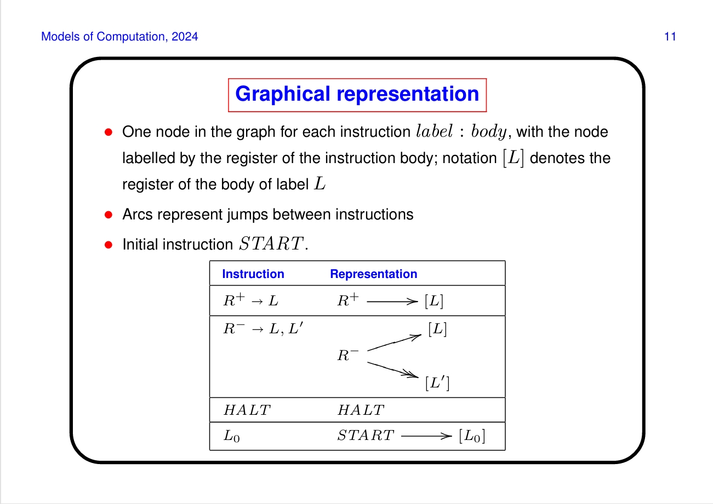
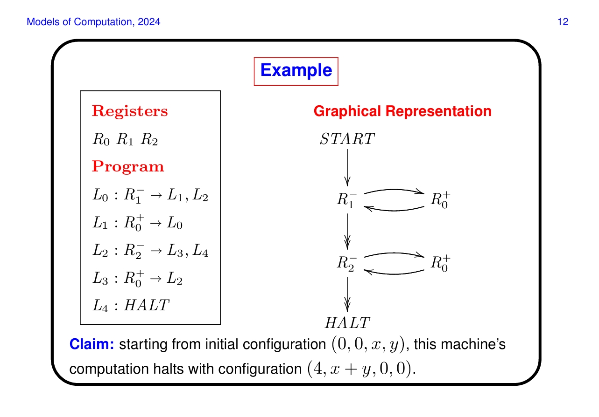
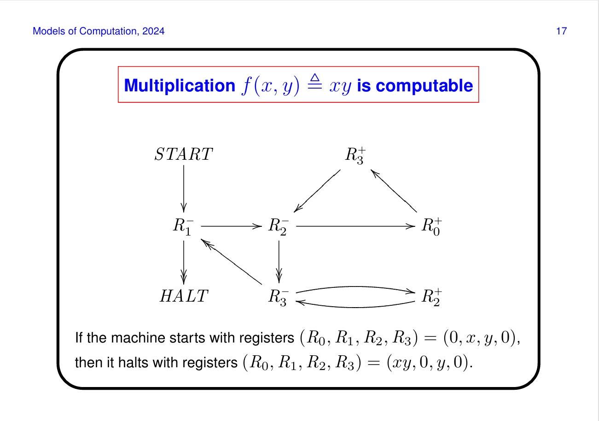

# Register Machines
## come common fesatures about the historical algorithms
- finite descriptions of the procedure of elementary operations
(drown a person, if he dies then not witch, if not dead then witch and killed)

- deterministic, next step is uniquely determined if there is one
- procedures may not terminate, but we can recognise when it does terminate and the result

## register machines
- add 1 to the contents of a register
- test whether the contents of a register is 0
- subtract 1 form the contents of a register if it is not 0
- jumps to ("goto")
- conditionals ("if then else")

thing can go wrong if the stuff went negative

### definition:
a register machine is specified by:
- finite many register $R_0, R_1, ..., R_n$ eahc capable to storing a natural numebr
- a program consisting of a finite list of instruction of the form label: body where, $\forall i = 0,1,2,...$ the (i+1)th instruction has label $L_i$,  the instruction body take the form:

$\begin{array}
R^+\to L' & \text{add 1 to the contents of register R and jump to instruction label L'}\\
R^-\to L',L"&\text{if the content of R is greater than 0, the subtract one and jump to L' else jump to L"}\\
HALT & \text{stop executing instructions}
\end{array}$

for example

registers: $R_0, R_1, R_2$

Program:
- $L_0: R_1^- \to L_1, L_2$
- $L_1: R^+_0 \to L_0$
- $R_2^- \to L_3,L_4$
- $L_3: R_0^+\to L_2$
- $L_4: HALT$

so this sums up $R_1, R_2$ and put it into $R_0$

### configuration:
A register machine configuration has the form

$c = (l,r_0,...,r_n)$

where l is the current label and $r_i$ is the current contents of $R_i$

**Notation** $R_i = x[\text{in configuration c}] \iff c = (l, r_0,...r_n)$ with $r_i = x$

**Initial configurations** $c_0 = (0, r_0,...r_n)$

### Computation:
A computation of a RM is a (finite or infinte) sequence of configurations

$c_0, c_1, c_2$

- $c_0 = (0, r_0,...r_n)$ is the initial configuration
- each $c = (l, r_0...,r_n)$ in the sequence determine the next configuration in the sequence by carrying out the program instruction labelled $L_l$ with reigsters containing $r_0,... r_n$

### Halting Computations

for a finite computation , the last configuration $c_m = (l, r, ...)$ is a halting configuration, so the instruction with $L_l$
- HALT
- $R^+->L, R^-\to L, L'(R>0)$ or $R^-\to L',L(R = 0)$ and there is no instruciton labeled L in the program

$L_0: R^+_2 \to L_2$ and $L_1:HALT$ halts erroneously

### No Halting computations
the computation never halts(a loop)

### Graphical representation

instruction is label: body, [L] denotes the register of the bosy of label L

arcs represent jumps between instrucitons

Initial instruction START

## Partial functions
definition:

$(x,y)\in f\wedge (x,y')\in f \to y = y'$

because register machine are deterministic, so the next configuration is uniquely defined by the program, so th e relation between the initial and final register contents is a partial function

- $f(x) = y$ means $(x,y) \in f$
- $f(x)\downarrow$ means $\exist y\in Y(f(x) = y)$
- $f(x)\uparrow$ means $\neg\exists y\in Y(f(x) = y)$
- $x\rightharpoonup y$ = set of all partial functions from X to Y
- $x\to Y$ = set of all (total) functions from X to Y

## computable functions

$f\in\mathbb{N}^n\to \mathbb{N}$ is computable if the RM has at least n+1 registers and $(x_1,...x_n)\in \mathbb{N}^n$ and all $y\in\mathbb{N}$

the computation of M starting with $R_0 = 0, R_1 = x_1,...R_n = x_n$ and other registers set ot 0, halts with $R_0 = y$ if and onyl if $f(x_1, ...x_n) = y$

e.g. multiplicationis computable

## the halting problem

The halting problem is the decision problem with
- the set S of the pair (A,D) where A is an algorithm and D is some input datum on which the algorithm is designed to operate
- $A(D)\downarrow$ holds for $(A,D)\in S$ if algorithm A when applied to D eventually produces a result: that is, eventually halts.

this problem is unsolvable, or no algorithm H such that

$\forall (A,D)\in S,H(A,D) = \begin{cases}\begin{array}1 & A(D)\downarrow\\0 & \text{otherwise}\end{array}\end{cases}$

## Numerical coding of pairs

**definition**

For $x,y\in\mathbb{N}$, define $\begin{cases}《x,y》\triangleq 2^x(2y+1)\\<x,y>\triangleq 2^x(2y+1) - 1\end{cases}$

x is the digits to shift, and y determines the front several digits

0b《x,y》 = 0by|1|0...0, x number of 0s

0b <x,y> = 0by|0|1...1, x number of 1s

we can prove these form bijections with natural numbers

**example**

27 = 0b11011 = 《0，13》 = <2,3>

**result**

《-，-》gives a bijection between $\mathbb{N}\times\mathbb{N}$ and $\mathbb{N}^+ = \{n\in\mathbb{N}|n\neq 0\}$

<-,-> gives a bijiection between $\mathbb{N}\times\mathbb{N}$ and $\mathbb{N}$

## Numerical coding of lists

let List $\mathbb{N}$ be the set of all finite lists of natural numbers, defined by:

- empty list: []
- list cons $x::l\in List \mathbb{N}$ and $l\in List\mathbb{N}$

**Notation**:$[x_1, x_2,..., x_n]\triangleq x_1::(x_2::(...x_n::[]...))$

For $l\in List\mathbb{N}$ define  $^{\lceil} l^{\rceil}\in\mathbb{N}$ by induction on the length of the list

$l:\begin{cases}^{\lceil} l^{\rceil}\triangleq 0\\^{\lceil}x::l^{\rceil}\triangleq《x,^{\lceil} l^{\rceil}》= 2^x(2\bullet ^{\lceil} l^{\rceil} + 1)\end{cases}$

Thus, $^{\lceil}[x_1, x_2,...,x_n] = 《x_1,《x_2,... 《x_n, 0》...》》$

so for example

$^{\lceil}[3]^{\rceil} = ^{\lceil}3::[]^{\rceil} = 《3,0》 = 2^3(2+0+1) = 8 = 1000_2$ 

$^{\lceil}[1,3]^{\rceil} = 《1,^{\lceil}[3]^{\rceil}》 = 《1,8》 = 34 = 100010$

so you could see this encoding is just reversing the list, adding the element value amount of zero and add a 1 as separator

**result** The function $l\to^{\lceil}l^{\rceil}$ gives a bijection from $List\mathbb{N}$ to $\mathbb{N}$

## Numerical coding of Programs

so it would be nicer if we encoding a program in to binary codes

if we have the program

$\begin{array}{|c|}
\hline\\
L_0:body_0\\
L_1:body_1\\
\vdots\\
L_n:body_n\\
\hline
\end{array}$

then we can encode the program by 

$^{\lceil}P {^{\rceil}}\triangleq {^{\lceil}}\quad{^{\lceil}}body_0 {^{\rceil}},..., {^{\lceil}}body_n{^{\rceil}}\quad{^{\rceil}}$

where the numerical code $^{\lceil}body^{\rceil}$ of an instruction body is defined:

$\begin{cases}
\begin{aligned}
^{\lceil}R_i^+\to L_j^{\rceil} &\triangleq 《2i，j》\\
^{\lceil}R^-_i\to L_j,L_k^{\rceil} & \triangleq 《2i+1,<j,k>》\\
^{\lceil}HALT^{\rceil} &\triangleq 0\\
\end{aligned}
\end{cases}$

so return to the example, we could do this:

the even numbers represent minus operations, odds for plus and 0 for Halt

this list is then converted into the encoding like above

decoding is the same

Any $x\in\mathbb{N}$ decodes to a unique instruction $body(x)$

if $x = 0\to HALT$

else let $x = 《y,z》$

if y = 2i is even, then $R_i^+\to L_z$

else y = 2i+1, let $x = <j,k>$ in $R_i^-\to L_j, L_k$

for example

$786432 = 2^{19} + 2^{18} = 0b11\underbrace{0...0}_{18"0"s}$

$18 = 0b10010 = 《1,4》 = 《1,<0,2>》 = {^{\lceil}}R_0^-\to L_0,L_2{^{\rceil}}$

$0 = ^{\lceil}HALT^{\rceil}$

so $prog(786432) = \begin{array}{|c|}\hline L-0:R_0^-\to L_0,L_2\\L_1:HALT\\ \hline\end{array}$

# Universal Register Machines
## Gadgets:

a partial register-machine graph, has only one wire, and one or more exits

its like a function, may use other reigsters, call scratch register for temporary storage

for copying, we do first zero and add other to this

so copying $R_1$ to both $R_2$ and $R_3$ would be

