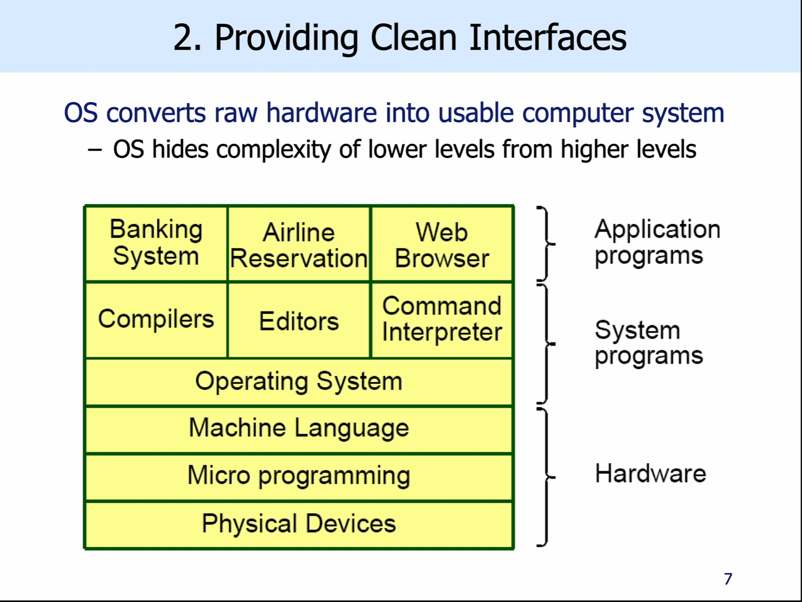
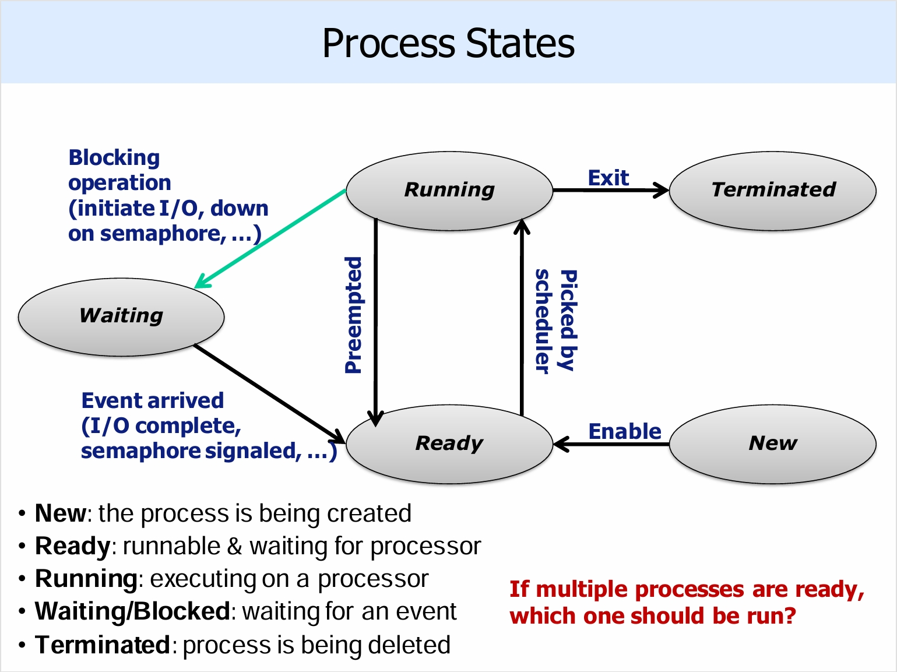
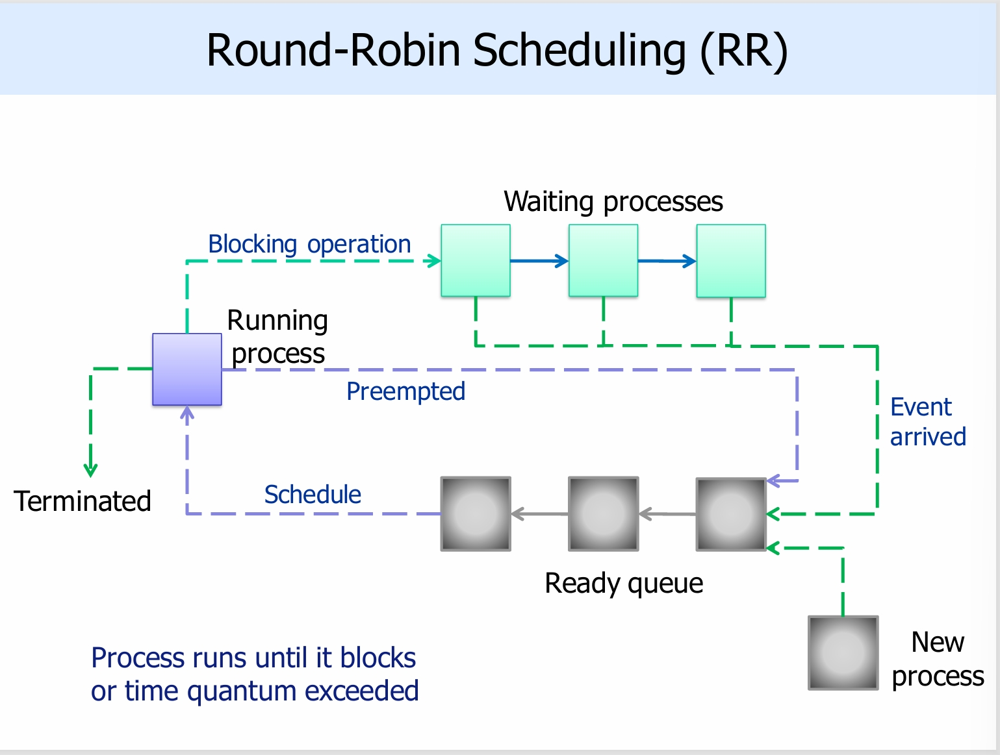
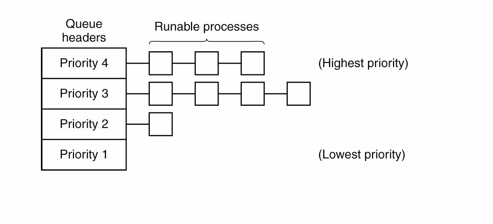

# pre-recorded lecture 1 intro
## Computer Architectur Overview


so the primary purpose of the operating system is to provide abstractions of clean interface to the applications

it should also control all the hardwar that connects to the computer

So OS need to 
## Manage Resources
OS must make efficient use of the limit avalible resource
- this includes time, space, money, etc..

OS have to share the resource among multiple users
- schedules access and offers a fair allocation
- prevent interference between users

The managed resources include
- Processors(mainly CPU stuff)
- Memory(caches, RAM, etc.)
- I/O devices
- Internal devices(clocks timer, interrupt controllers)
- Persistent storages(disks, SSDs, DVDs, tapes, etc..)

## Provide clean Interfaces

OS hides complexity of lower levels from higher levels and provide a clean interface

example:




## Sharing
OS must share data, programs and hardware
- OS use time multiplexing and space multiplexing for this(more later)

OS must offer resource allocation
- fair use of memory, CPU time, disk space
- simultaneous access to resuorce(Disks, RAM, network, GPU)
- mutual exclusion for some resources(guarantee that risky operations are protected)
- OS must protect against(accidental or malicious) corruption

## Concurrency
OS must support several simultaneous parallel activities
- multi users and programs must run in parallel

OS may switch activities at arbitrary times
- guarantee fairness and prompt replies

OS must ensure safe concurrency
- must offer primitives to sychronise actions
- protect user/process interference(Each program wants to have its own space)

## Non-determiniism
Because it is concurrent, results from events occur in an unpredictable order

## Storing Data
Persistent storage
- easy access to files
- access controls: protect the files so only authorised people can alter the file
- protest against failures
- manage storage devices

## OS functionality
- SImplified I/O (access disk, or remote file server or DVDs)
- Virtual memory(larger than physical memeory and partition)
- File systems(persistent storages)
- Program interaction and communication
- Network communication(sending/receiving data on network)
- Security(preventing program accessing unauthorised resuorce)
- UI
- other(Administration, managment, accounting)

## OS need to support different hardware

# lecture 2:
it just introduces different OS, linux and windows
# lecture 3: processes
## intro:
it is one of the oldest abstractions in computing

it allows a singe processor to run multiple programs simultaneously
- processes turn a single CPU into multiple virtual CPUs
- Each process runs on a virtual CPU

the processes are isoloated from each other, each with its own address space and program a does not worry about program b

## time-slicing:
this is one technique from concurrency

- OS switchses application running onn the physical CPU every 50ms

so we have 


we could optimise it like running gcc when firefox waits for input

## context switches:
the processor switches from executing process A to executing process B

it takes periodic scheduling decisions

it may switch processes(cannot be pre-determine because the events are non-deterministic)

### context switches are expensive
Direct cost: save/restore process state

Indirect cost: pertubation of memory caches, TLB
- Translation lookaside buffers(TLBS), caches mapping of virtual addresses to physical addresses, and is typically flushed on a context seitch
- (this will be continued in memory management lectures)

since this is costly, we need to avoid unnecessary context switches

## Process 
### Creation
they are created when 
- System init
- User request
- System calls

note that daemons are background tasks, that's why docker daemon

### Termination
- Normal completion
- system call: exit() in UNIX, ExitProcess() in Windows
- Abnormal exit: program run into an error or unhandled exception
- Aborted: Process stop due to overruling of its execution(e.g. killed)
- Never: Some processes run in endless loops and never terminated unless error occurs

###

## Case study UNIX:
### creating processes:
``` C
int fork(void)
```

this Creates a new child process by making the exact copy of parent process image

it returns twice
- in parent process: fork() returns process ID of child
- in child process: fork() returns 0

```C
#include <unistd.h>
#include <stdio.h>
int main() {
  if (fork() != 0) // if this is not in child process
    printf("Parent code\n");
  else printf("Child code\n");
    printf("Common code\n");
 }
```


on error, no child is created, and -1 is returned to the parent

```C
#include <unistd.h>
#include <stdio.h>
int main() {
  if (fork() != 0) 
    printf("A\n");
  else {
    if (fork() != 0) 
      printf("B\n");
    else printf("C\n");
  }
}
```

### executing process
```C
int execve(const char *path, chat *const argv[], char *const envp[])
```
args

- path: the full pathname of the program to run
- argv: args passed to main
- envp: environment variables

it changes process image amnd runs new process

for example, a command interpreter could do

```C
while (TRUE) {
  read_command(command, params);
  if (fork() != 0) // fork off child process, fork fails or is parent process
    waitpid(-1, &status, 0); // parent code
  else // at this point, we are certain is child process
    execve(command, parameters, 0); // child code
}
```

### Wait for process termination

```C
int waitpid(int pid, int* statis, int options)
```

suspends excution of calling process until process wihth PID pid terminates normally or a signal is recieved

we can wait for more than one child
- pid = -1: wait for any child
- pid = 0: wait for any child in the same process group as caller
- pid = - gid: wait for any child with process group gid

returns:
- pid of the terminated child process
- 0  if WNOHANG is set(call should not block) and no terminated children
- -1 on error, with the errno set to indicate error

In UNIX we have both fork() and execve()

but in Windows, CreateProcess() = fork + execve, but it has 10 params

### Process Termination
```C
void exit(int status)
```

terminates a process
- called implicitly when the program finished

never returns in the calling process
- returns an exit status to the parent process
- stored with in status pointer arg in waitpid()

```C
int kill(int pid, int sig)
```

send signal sig to process pid

### UNIX signals
Inter-Process Communication (IPC) mechanism

Signal delivery similar to delivery of hardware interrupts
- used to notify process when event occurs

process can send signal to another process if it has permission
- kernel can send signal to any process

#### when?
exception:
- division by zero -> SIGFPE
- segment violation -> SIGSEGV(you acces memory that is not avaliable)
- ...

when the kernel wants to notify the process of an event
- e.g. if process writes to a closed pipe -> SIGPIPE

when certain key combations are typed in a terminal
- e.g. Ctrl-C -> SIGINT(so you interrupt the process with ctrl + C)

programmatically using the kill() system call


the default action for most signals is to terminate the process

the recieving process may choose to :
- ignore it
- handle it by signal handler
- two signals cannot be ignored/handled: SIGKILL and SIGSTOP

```C
signal(SIGINT, my_handler)

void my_handler(int sig) {
  printf("Recieved SIGINT. Ignoring ...")
}
```


### UNIX Pipes:

pipe is connecting the standard output od one processs to the standard input of another

it allow **one-way** communication between processes

consider the linux commands

```
ls | less
cat file.txt | grep hello | wc -l
ls | tee my.txt
```

two types: unnamed, named


```C
int pipe(int fd[2])
```

so there is a fd(file desciptor) table in the kernel, and the address of the two ends are stored in the fd table, the child process copies the fd table

it return two file descriptor in fd
- fd[0] the read end of the pipe
- fd[1] the write end of the pipe

sender shoudl close the read end

reciever should close the write end

If receiver reads from empty pipe, it blocks until data is written at the other end

If sender attempts to write to full pipe, it blocks until data is read at the other end

```C
int main(int argc, char *argv[]) {
  int fd[2]; char buf;
  assert(argc== 2); // if the number of args is not 2, exit
  if (pipe(fd) == -1) exit(1); // if pipe unavaliable, exit
  // this also creates a pipe between the two args in fd
  if (fork() != 0) {
    close(fd[0]);
    write(fd[1], argv[1], strlen(argv[1]));
    close(fd[1]);
    waitpid(-1, NULL, 0);
  } else {
    close(fd[1]);
    while (read(fd[0], &buf, 1) > 0)
      printf("%c", buf);
    printf("\n");
    close(fd[0]);
  }
}
```

at the end of the process, the pipe is closed

named pipes: outlive process which create them

they are store on file system

we want to use these because its faster, it is store in the RAM instead of being optimised by the file system
```
mkfifo /tmp/abc
echo ABC >/tmp/abc
```

```
cat /tmp/abc

(we get ABC)
```

a pipe is just a buffer, it stores the data from the memory, calling it retrieves data from the buffer

# lecture 4: threads

threads are execution atreams that share the sma eaddress space

if multithreading is used, each process can contain one or more threads

## why thread?
many appplications contain multiple activities
- executes in parallele
- access and process the same data
- some of which may block

## why not process
processes are too heavyweight
- diificult to communicate between different address spaces
- Activity that blocks may switch out th eentire application
- Expensive to context switch
- expensive to create/destory activities

## problems with thread
shared address space
- memory corruption: one thread can write another thread's stack
- concurrency bugs: conccurrent access to shared data(possible race conditions)

forking: the previous forking copies the current process, but multiple threads run at the same time

signals
- when a signal s arrives, which thread should handle it (currently, all the threads are able to handle it, so we dont know which thread will do it)

## case study: PThreads

PThread(POSIX Threads)

defined by IEEE standard and implemented by most UNIX systems

```C
#include <pthread.h>
#include <sys/types.h>
pthread_t       //type representing a thread 
pthread_attr_t  //type representing the attributes of a thread
```

### create a new thread

```C
int pthread_create(pthread_t *thread, const pthread_attr_t *attr, void *(*start_routine)(void*), void *arg)
```

- the newly created thread is stored in *thread
- function return 0 if the thread was successfully created, or error code

args:

- attr: the thread attributes, can be NULL for default
- start_routine: C function the thread will start executing
- arg: args to be passed to start_routine(of pointer type void*) can be NULL

```C
#include <pthread.h>
#include <stdio.h>
#include <unistd.h>
void *thread_work(void *threadid) {
  long id = (long) threadid;
  printf("Thread %ld\n", id);
}
int main (intargc, char *argv[]) {
  pthread_t threads[5];
  long t;
  for (t=0; t<5; t++)
    pthread_create(&threads[t], NULL,
  thread_work, (void *)t);
  sleep(10);
}
```

### Terminating thread:
```C
void pthread_exit(void *value_ptr)
```

Terminates the thread and makes value_ptr avaliable to any successful join with the terminating thread

- not for the initial thread that start main()
- if main terminates before other threads, calling pthread_exit(), the entire process is terminated
- if pthread_exit() is called in main(), the process continues executing until last thread terminates(or exit())

### yielding the CPU

```C
int ptherad_yield(void)
```

relesease the CPU to let another thread run, returns 0 on success, or an error code

should not use this because we dont know the next time we are going to run the thread that yields again

### Joining the threads

```C
int pthread_join(pthread_t thread, void **value_ptr) 
```

block until thread terminates

the value_ptr will be passed to pthread_exit()

```C
#include <pthread.h>
#include <stdio.h>
long a, b, c;
void *work1(void *x) { a = (long)x * (long)x;}
void *work2(void *y) { b = (long)y * (long)y;}
int main (int argc, char *argv[]) {
  pthread_t t1, t2;
  pthread_create(&t1, NULL, work1, (void*) 
3);
  pthread_create(&t2, NULL, work2, (void*) 
4);
  pthread_join(t1, NULL); // a is assigned to 9 only after the thread
  pthread_join(t2, NULL); // b is assigned to 16 only after the thread
  c = a + b;
  printf("3^2 + 4^2 = %ld\n", c);
}
```

### Implementing Threads

#### User-level threads:
- OS kernel is not aware of the threads
- Each process manages its own threads
OS-kernel thinks it is mamaging processes only
- the threads are implemented by software library
- Process maintains thread table for thread scheduling

advantages:

it is fast
- thread creation and termination are fast
- thread switching is fast(only do registers)
- thread synchronisation(e.g. joining other threads) is fast
- All these operations do not require kernel involvement

Each application can have its own schduling algorithm


disadvntages

blocking system calls stops all threads in process

- denies one core motivations for using threads

Non-blocking I.O cna be used(e.g. select())

- not elegant

During page fault OS blocks the whold process

- But other threads may be runnable


#### Kernel-level threads

- Managed by the OS kernel

pthreads are kernel-levels

advantages

blocking system calls/page faults can be easily accommodated

- if one thread calls a blocking system call or causes a page fault, the kernel can shedule a runnable thread from the same process

disadvantages:

thread creation and termination more expensive
- require system calls(but still cheaper than process creation/termination)
- one mitigation is to recycle threads(thread pools)

thread synchronisation more expensive
- requires blocking system calls

thread switching more expensive
- require system calls(still cheaper than process switches(same address space))

no application-specific schedulers

#### hybrid approaches

# lecture 5: scheduling

the process states is just a finite state machine



## goals of scheduling algorithms
Ensure fairness
- comparable processes should get comparable services

Avoid indefinite postponement
- No process should starve

Enfore policy
- E.g. priorities

Maximise resource utilisation

Minimize overhead
- From context switches, scheduling decisions

Batch systems: (Give a batch of task to the system, just do it as fast as possible)
- Thoughput: Jobs per unit time
- Turnaround time: TIme between job submission and completion

Interactive systems:
- Response time crucial: TIme between request issued and first response

Real-time systems:
- Meeting deadlines:
- - Soft deadlines: leads to degraded video quality(360p, 1080p)
- - Hard dealine: e.g. leads to plane crash

## preemptive and non-preemptive scheduling
non-preemptive
- let process run until it blocks or voluntarily release CPU

preemptive:
- let process run for a maximum amount of fixed time
- reuqires a clock interrupt

## CPU -bound or I/O boun

CPU bound processes
- spend most of their time in the CPU

I/O bound processes
- spend most of their time waiting for I/O
- Tend to only use CPU briefly before issuing I/O request

## First-Come First-Served(FCFS)(non-preemptive)


### advantage:
No indefinite postponement
- All processes are eventually scheduled

Really easy to implement

### FCFS Disadvantages

consider a long job is follows by many short jobs

3600s -> 1s -> 1s -> 1s

- Throughput: 3603/4
- Average turnaround time: 14406 / 4

1s -> 1s -> 1s -> 3600s

- Throughput: 3603/4
- Average turnaround time: 3606/4

## Round-robin


Fairness
- ready jobs gets equal shar of the CPU

Response time
- Good for small number of jobs

Average turnaround time:
- Low when run-times differ
- Poor for similar run-times

### RR-Quantum(Time slice)
RR Overhead:
- 4ms quantum, 1ms context switch time: 20% time -> overhead
- 1s overhead, 1ms context switch time: 1% -> overhead

so 

Large quantum -> smaller overhead, worse response time

small quantum -> large overhead and better response time

the quantum should be much larger than context switch cost, but provide decent repsonse time

typical value: 10ms - 200ms

- linux: 100ms
- windows client: 20ms
- windows server: 180ms

## Shortest Job First (SJF)

Non-preemptive scheduling with run-times known in advance, then we pick the shortest job first


if A(8) -> B(4) -> C(4) -> D(4)

then the turanaround time is 8 + (8 + 4) + (8 + 4 + 4) + (8 + 4 + 4 + 4) = 56

if B(4) -> C(4) -> D(4) -> A(8)

then the turnaround time is 4 + (4 + 4) + (4 + 4 + 4) + (4 + 4 + 4 + 8) = 44

### Shortest Remaining Time(SRT)

this is a preemptive version of Shortest Job First
- Runtime have to be known in advance

choose the process whose remaining time is shortest

so


### problem: how to know the runtime in advance?

they are not usually available in advance

Compute CPU burst estimates based on heuristics
- E.g. based on previous history
- Not always applicable

User-supplied estimates
- need to counteract cheating to get higher priority

## Fair Share Scheduling:
Users are assigned some fraciton of the CPU
- Schduler takes into accoun twho owns a process before scheduling it

assume each user take 50% of the CPU
- User 1: ABCD
- User 2: EF

A RR scheduler would maybe do A E B F C E D A E B F C E D F

so the user list is iterated when scheduling

## Priority Scheduling

Jobs are running based on their priority(consider PintOS)

they can be externally defined or based on some process-specific metrics

they can be static(do change) or dynamic(pintos)

the processes with the highest priorities is going to run first

## General-Purpose Scheduling

Favoue short and IO bound jobs
- good resource utilisation and short response times

they react quickly and can adpat to changes
- each process have IO-bound periods and CPU-bound period

## Multilevel Feedback Queues
form this on, this would be implementations

implemented on many OSs including pintos

one queue for each priority level, in each queue, we can use round-robin

consider the zipping method in hashset for resolving conflict in same hashcode



### Concerns:
need to determine current nature of the job (IO-bound /CPU-bound)

Need to worry about starvation of lower-priority jobs

feedback mechanism:
- priorities recomputed periodically
- Aging: increse job;s priority as it waits

this is not very flexible and does not react fast to changes
- apps have no control
- priorities make no guarantee
- often need warm-up

Cheating is a consern:
- may add meaningless I/O to boost priority

Cannot donate priority

## Lottery Scheduling

Jobs recieve lottery tickets for various resources

at each decision, one ticket is chosen at random and the job holding the ticket wins

so if 100 tickets and P1 has 20 tickets, then in the long run P1 gets 20% of the CPU time

### characteristics:
Number of lottery tickets is meaningful, unlike priorities

this is highly responsive
- new job given p% of tickets has the p% chance to get the resource at the next scheduling decision

no starvation

jobs can exchange tickets for donations

adding or removing the jobs affect remaining jobs proportionally

Unpredictable response-time: unlucky

## Summary:
s
Scheduling algorithms often need to balance conflicting goals, so different algorithms are suitable for different scheduling goals