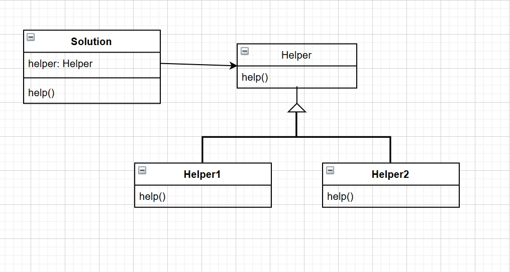

# SED3
so for this exercise, we are going to implement the sequence with strategy or template methods

## strategy:

basically we do this:

```Java
public class Helper {
  // this would actually be an interface to be more clear
  // but dont have to
}

public class Helper1 {
  // something
}

public class Helper2 {
  // something
}

public class Solution {
  public Solution (Helper helper) {
    this.helper = helper
  }
}
```



## template

another name for inheritance

so we basically do this

```Java
public abstract class Helper {
  //something
}

public class Helper1 extends Helper {
  //something
}

public class Helper2 extends Helper {
  //something
}
```