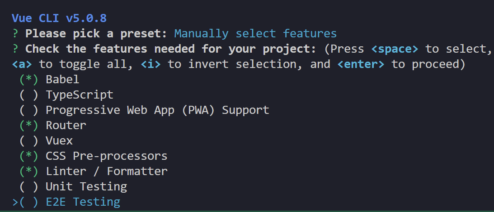

# VUE2:
用于创建UI的框架

这一部分主要是先vue2,然后3
## 简介:
### 创建实例:
$\begin{cases}
准备容器\\
引包\\
\text{new VUE()}\\
指定配置项\to 渲染数据\begin{cases}el指定挂载点\\data提供数据\end{cases}
\end{cases}$

!!! info
    === "示例"
        examples/vue/intro.html

### 插值表达式:

- 语法 {{表达式}}
  - 使用的数据必须存在,undefined不行
  - 支持的是表达式,if for等不行
  - 不能在标签属性中使用插值

数据改变,渲染会自动改变

### vue指令:
一堆以v-开头的标签属性,和自定义标签的data-一样
#### v-html:
相当于设置了该标签的innerHTML

!!! info
    === "说明"
        请自行查看examples/vue/v-html.html

#### v-show & v-if:
- v-show
  - v-show="表达式": 如果表达式是true显示元素,否则隐藏
  - 本质切换的css的display属性
  - 一般用于频繁切换显示隐藏的场景
- v-if: 
  - v-if="表达式": 如果表达式是true显示元素,否则隐藏
  - 创建或者移除
  - 直接销毁节点,不能来回切换
!!! info
    === "说明"
        请自行查看examples/vue/v-ifv-show.html, 同时和v-if配对的v-else: examples/vue/v-else.html
#### v-on:
事件监听
!!! example
    === "v-on:事件名=内联语句"
      ```html
      <!--v-on:事件名="内联语句"-->
      <button v-on:click="count++">按钮</button>
      ```
    === "v-on:事件名=methods中的函数名" 

      ```html
      <!--这个时候要在VUE实例传入methods参数-->
      <button v-on:click="count"></button>
      ```
    === "@事件='...'"

      ```html
      <!-- 可以把v-on:事件替换成@事件 -->
      <!-- 也可以写成类似 -->
      <button @click="fn(fullscore)">切换</button>
      ```
      这样来传参,可以直接传入VUE实例中的数据
    === "示例"
        请自行查看examples/vue/v-on.html

#### v-bind:
直接设置一个属性

!!! example
    === "代码"
        ```html
        
        ```
    === "省略v-bind"
        ```html
        
        ```
    === "示例"
        请自行查看examples/vue/v-bind.html

##### v-bind扩展 class

!!! example
    === "对象形式"
        ```html
        <div class="box" :class="{类名1:bool,类名2:bool}"></div>
        // 对于对象中的每个entry,如果bool是true,classList加入这个类,否则不加入
        ```
    === "数组形式"
        ```html
        <div class="box" :class="[类名1,类名2,类名3]"></div>
        // 对于对象中的每个entry,如果bool是true,classList加入这个类,否则不加入
        ```

#### v-for

!!! example
    === "代码"
        ```html
        <p v-for="(item, index) in 数组"><p>
        ```
    === "示例"
        请自行查看examples/vue/v-for.html

##### key
假设有
```css
ul:nth-child(1){
    background-color: red;
}
```

实际上如果设了key的话,v-for会按照key查找,比如有5个元素,key为1,2,3,4,5,删掉第一个之后

#### v-model:
给表单元素使用,双向数据绑定,可以快速设置和获取元素

##### 常见表单:
- 输入框 input:text
- 文本框 textarea
- 复选框 input:checkbox
- 下拉菜单 input:radio
- $\dots$

#### 指令修饰符:
- 按键修饰符: 
  - @keyup.enter: keyup是按键弹起,后面加上enter监听键盘回车
- v-model修饰符: 
  - v-model.trim: 去除首尾空格
  - v-model.number: 转数字
- 事件修饰符: 
  - @事件名.stop : 阻止冒泡
  - @事件名.prevent: 阻止默认行为

!!! info
    === "示例"
        examples/vue/v-model.html 以及 examples/vue/v-modelEg.html 以及examples/vue/commandAttr.html

## 计算属性:
根据现有的数据运算,根据数据变化自动重新计算

在VUE实例中加computed属性
### computed / methods
- computed:
  - 写在computed里
  - 可以直接使用this.计算属性或者{{计算属性}}
  - 会对属性进行缓存,更新的时候再缓存,性能更高
- methods:
  - 写在method里,提供一个函数
  - 使用的时候需要调用
  
### 计算属性的完整写法(用于修改):
kotlin写法,就是kotlin但是默认private set

!!! example
    === "代码"
        ```javascript
        computed: {
            属性名: {
                get(){
                    //something(计算属性)
                    return 结果
                },
                set(){
                    //something(修改)
                }
            }
        }
        ```
    === "示例"
        请自行查看examples/vue/computedAttr.html
## watch监听器:
### 简单写法:

!!! example
    === "代码"
        ```javascript
        data:{
            a: someValue,
        }
        watch:{
            属性名 (newValue, oldValue){
                // something
            },
            '对象.属性名' (newValue, oldValue){
                // something
            }
        }
        ```
    === "示例"
        examples/vue/watch.html

这个时候可以额外做防抖,

### 完整写法:
添加额外配置项
- deep:true 对复杂类型深度监视
- immediate:true 初始化的时候立即执行一次handler方法

!!! example
    === "代码"
        ```javascript
        data:{
            obj:{
                words:"苹果",
                lang:"italy"
            }
        },
        watch:{
            数据属性名{
                deep:true
                handler(newValue){
                    //something
                }
            }
        }
        ```
    === "示例"
        examples/vue/watchComplete.html

## VUE生命周期:
- 开始: new Vue()
- 结束: 关闭网页
### 四个阶段
- 创建阶段:把data换成响应式的数据
- 挂载阶段:渲染模板
- 更新阶段:数据修改,更新视图
- 销毁阶段:销毁实例

### 钩子函数:
一共八个
- 创建阶段
  - beforeCreate (这个时候没有响应式数据)
  - created (这个时候发送初始化渲染请求)
- 挂载阶段
  - beforeMount
  - mounted (这一刻开始才有DOM)
- 更新阶段
  - beforeUpdate
  - update
- 销毁阶段
  - beforeDestroy (可以释放一些资源,清楚计时器延时器等)
  - destoryed

!!! info
    === "示例"
        examples/vue/hook.html


## 脚手架VUE CLI
- 工程化开发
$\begin{array}{c}
\begin{array}{|c|}
\hline\\
源代码\\
\hline
\end{array}\\
\text{es6语法/typescript}\\
\text{less/sass}\\
\dots
\end{array}\to
\begin{array}{c}
\begin{array}{|c|}
\hline\\
自动化编译压缩组合\\
\hline
\end{array}\\
\text{webpack}\\
\\\\
\end{array}\to
\begin{array}{c}
\begin{array}{|c|}
\hline\\
源代码\\
\hline
\end{array}\\
\text{js(es3/es5}\\
\text{css}\\
\dots
\end{array}$
- 全局安装: yarn global add @vue/cli 或者 npm i @vue/cli -g
- 查看Vue版本: vue --version
- 创建项目架子: vue create project-name(项目名称,不能用中文)
- 启动项目: yarn serve 或者 npm run serve, 会自动找package.json

### 脚手架目录:
!!! info
    === "示例"
        examples/vue/vue2example
VUE-DEMO
```
├─node_modules           第三方文件夹
│
├─public                 放html的地方
│      favicon.ico        网站图标
│      index.html         index.html模版文件
└─src                    源代码目录 -> 以后写代码的文件夹(重要)
│  │  App.vue            APP根组件 -> 项目看到的内容在这里编写(重要)
│  │  main.js            入口文件 -> 打包或运行,第一个执行的文件(重要)
│  │  
│  ├─assets             静态资源目录 -> 存放图片字体等
│  │      
│  └─components         组件目录 -> 存放通用组件
│  .gitignore             git忽视文件
│  babel.config.js        babel配置文件
│  jsconfig.json          js配置文件
│  package.json           项目配置文件, 和webpack那个一样
│  README.md              git README
│  vue.config.js          vue-cli配置文件
│  yarn.lock              yarn锁文件,由yarn自动生成,锁定安装版本
            
```

#### index.html
```html
<!DOCTYPE html>
<html lang="">
  <head>
    <meta charset="utf-8">
    <meta http-equiv="X-UA-Compatible" content="IE=edge">
    <meta name="viewport" content="width=device-width,initial-scale=1.0">
    <link rel="icon" href="<%= BASE_URL %>favicon.ico">
    <title><%= htmlWebpackPlugin.options.title %></title>
  </head>
  <body>
    <noscript> <!--给不支持js的浏览器一个提示-->
      <strong>We're sorry but <%= htmlWebpackPlugin.options.title %> doesn't work properly without JavaScript enabled. Please enable it to continue.</strong>
    </noscript>
    <div id="app">
      <!--这里本来应该是VUE容器,但是工程化开发中不在这里写,而是在App.vue里写-->
    </div>
    <!-- built files will be auto injected -->
  </body>
</html>

```

#### main.js
```javascript
import Vue from 'vue'
import App from './App.vue'

console.log(123)
console.log(456)

Vue.config.productionTip = true // true为开发模式,false为生产模式

new Vue({
  el: "#app",
  // render: h => h(App),
  // 完整render写法:
  render: (createElement) => {
   return createElement(App)
  }
})//.$mount('#app')// 这里$mount和el作用完全一致
```
### 组件化开发

!!! info
    === "示例"
        examples/vue/vue2example/src/components

把一个网页拆成多个结构分开维护

其中根组件是整个应用最上层的组件,包裹所有普通小组件

App.vue可以分成三个组成部分

```html
//这一部分是结构,定义网页布局(在VUE2中有且只有一个根元素)
<template>
  <div id="app">
    
    
    <HelloWorld msg="Welcome to Your Vue.js App"/>
  </div>
</template>

//这一部分定义行为
<script>
// 这里可以提供 data(特殊) methods, computed, watch 以及狗子函数
import HelloWorld from './components/HelloWorld.vue'

export default {
  name: 'App',
  components: {
    HelloWorld
  }
}
</script>

//这一部分定义样式
//如果需要让这个支持less,需要设置lang="less"
//然后装less-loader和less
<style>
#app {
  font-family: Avenir, Helvetica, Arial, sans-serif;
  -webkit-font-smoothing: antialiased;
  -moz-osx-font-smoothing: grayscale;
  text-align: center;
  color: #2c3e50;
  margin-top: 60px;
}
</style>

```

### 普通组件的注册使用

!!! info
    === "示例"
        examples/vue/vue2examples/src/App.vue

- 局部注册: 只能在注册的组件中使用
  - 创建.vue文件(三个组成部分)(在components文件夹里)
  - 在使用的组件内导入注册, 然后就可以知己当做html标签使用

```html
// 比如:

<template>
  <div class="App">
    <!--头部组件-->
    <ExampleHeader></ExampleHeader>
    <!--主体组件-->
    <ExampleBody></ExampleBody>
    <!--底部组件-->
    <ExampleTail></ExampleTail>
  </div>
</template>

<script>
import ExampleHeader from "./components/ExampleHead.vue"
import ExampleBody from "./components/ExampleBody.vue"
import ExampleTail from "./components/ExampleTail.vue"
export default {
  components: {
    //"组件名":"组件对象"
    ExampleHeader: ExampleHeader,
    ExampleBody: ExampleBody,
    ExampleTail: ExampleTail
  }
}
</script>

<style>
.App{
  width: 600px;
  height: 700px;
  background-color: #87ceeb;
  margin: 0 auto;
  padding: 20px;
}
</style>
```

- 全局注册: 所有组件都能使用
  - 创建.vue文件(三个组成部分)
  - main.js中进行全局注册
  
  和上面那个相比
  ```javascript
  import something from someFile
  Vue.component("something", something)
  ```

敲< vue>可以快捷生成模版(vscode插件)

### 三个组成部分
三个组成部分:
- < template>: 只能有一个根元素
- < style>:
  - 全局样式(默认): 影响所有组件
  - 局部样式: scoped下的样式,之作用于当前组件
- < script>
  - el根示例独有
  - data是一个函数
  - 其他配置项一致
#### scoped:
!!! info
    === "示例"
        examples/vue/vue2examples/components
默认: 写在组件里的样式会全局生效,容易造成组件之间的样式问题

```html
<style scoped>
    //各种样式
</style>
```
这样就只会在当前组件生效

scoped的原理是给当前模版内的所有元素,都会被添加上一个 data-v-哈希值 自定义属性

#### data是一个函数:

!!! info
    === "示例"
        examples/vue/vue2example2/src/components/BaseOne.vue

一个组件的data选项必须是一个函数,保证每个组件实例维护独立的一份数据对象

### 组件通信:

组件和组件之间传递数据
- 组件的数据是独立的,无法直接访问其他组件的数据

组件关系:
- 父子关系
  - props和$emit
- 非父子关系
  - provide & inject
  - eventbus


#### 父子关系:
!!! info
    === "示例"
        example/vue/vue2communicate 中父组件App.vue和子组件UserInfo.vue之间的props传递变量,之前没写emit，这回加上了

- 父组件通过props将数据传递给子组件
- 子组件通过$emit使用数据


```html
//父组件
<template>
    <div>
        <Son :title="myTitle" @keyword="fatherFn"></Son>
    </div> 
</template>

<script>
import Son from ...
export default{
    data(){
        return {
            myTitle: "something"
        }
    },
    methods:{
        fatherFn(){
            //something
        }
    },
    components:{
        Son,
    }
}
</script>
```

```html
//子组件
<template>
    <div>
    {{title}}
    </div> 
</template>

<script>
export default{
    props: ["title"],
    methods: {
        sonFn(){
            //something
            this.$emit("keyword",**kwargs)
        }
    }
}
</script>
```

##### props：
是组件上注册的一些自定义属性

prop作用:向子组件传递数据

可以传递任意数量,任意类型的props

##### props校验:
给prop验证要求,不符合要求就会有错误提示

- 类型校验:

```javascript
props:{
  校验的属性名: 类型
}
```

- 非空校验，默认值，自定义校验

```javascript
props: {
    校验的属性名： {
        type: 类型， // Number String Boolean ...
        required: true, // 是否必填
        validator (value) {
            // 自定义校验逻辑
            return 是否通过校验
        }
    }
}
```

##### prop和data:
- data的数据是自己的: 随便改
- prop的数据是外部的: 不能随便改,要遵循单向数据流(父组件的数据改动会自动向下流动)

#### 非父子关系: eventbus事件总线:
!!! info
    === "示例"
        examples/vue/vue2eventbus

复杂场景用vuex（vue2）, pinia(vue3)

- 创建一个都等你访问到的事件总线(空的VUE实例),一般会存到utils文件夹下

  ```javascript
    import Vue from 'vue'
    const Bus = new Vue()
    export default Bus
  ```
- 接收方监听Bus实例的事件
  ```javascript
  Bus.$on('sendMsg', (msg) => {
      this.msg = msg
  })
  ```
  
- 发送方触发Bus实例的事件
  ```javascript
  Bus.$emit('senfMsg','消息')
  ```
#### 非父子通信: provide&inject
!!! info
    === "示例"
        example/vue/vue2inject


跨层级共享数据

```javascript
//父组件
export default{
    provide(){
        return{
            color: this.color,
            userInfo: this.userInfo
        }
    }
}
```

```javascript
//子组件
export default{
    inject: ["color","userInfo"],
    created(){
        console.log(this.color, this.userInfo)
    }
}
```

这个案例里面简单类型(color)是响应式的,如果修改,相应的渲染不会修改

但是复杂类型(userInfo)被修改的时候相应的渲染也会被修改

### v-model:
!!! info
    === "示例"
        examples/vue/v-model.html 以及 examples/vue/v-modelEg.html

本质是value属性和input时间的和写

```html
<template>
    <div>
        <input v-model="msg" type="text">
        
        <input :value="msg" @input="msg = $event.target.value" type="text">
    </div>
</template>
```

#### 表单类组件封装:
!!! info
    === "示例"
        example/vue/vue2form

数据由父组件提供,子组件修改
- 父传子: props传下去, v-model拆解绑定数据
- 子传父: 监听输入, 传给父组件修改
  - 在传给父组件的时候可以用$event直接获取形参
                                    
```html
<template>
  <div id="app">
    <BaseSelect
     :cityId="selectId"
     @changeCity="selectId = $event"
    >
    </BaseSelect>
    <p>{{selectId}}</p>
  </div>
</template>

<script>
import BaseSelect from "./components/BaseSelect.vue"
export default {
  data(){
    return {
      selectId: "102"
    }
  },
  components:{
    BaseSelect
  },
  methods:{
    changeId(value){
      this.selectId = value
    }
  }
}
</script>

<style>

</style>
```

子组件不能用v-model因为数据是父组件的,但是父组件可以用v-model

父组件v-model简化代码,实现子组件和父组件数据双向绑定

比如在上面的例子中,这个是父组件,所以可以直接用v-model

```html
<BaseSelect
 v-model="selectId"
>
</BaseSelect>
```

但是子组件的$emit函数中只能是'input', props中只能是value,局限性较大
               

### sync修饰符:
!!! info
    === "示例"
        example/vue/vue2sync

可以实现子组件和父组件的双向绑定,简化代码

就是:属性名和@update:属性名的合写

- prop属性名可以自定义,不固定为value

!!! info
    === "sync"
        ```html
        <BaseDialog :visible.sync="isShow"/>
        ```
    === "等同于sync"
        ```html
        <BaseDialog
          :visible="isShow"
          @update:visible="isShow = $event"
        />
        ```
    === "子组件"
        
        ```html
        <!--子组件-->
        props:{
          visible: Boolean
        }

        this.$emit('update:visbale', false)
        ```

### ref 和 $refs
!!! info
    === "示例"
        example/vue/vue2ref

queryselector的查找范围是整个文档，但是ref和$ref的查找范围是当前组件

通过this.$refs在这个组件里查询这个元素

```html
<div ref="something" class="someclass"></div>

this.$refs.myChart
// 也可以调用这个组件的方法
this.$refs.myChart.someMethod()
```

### vue异步更新, $nextTick

!!! info
    === "示例"
        example/vue/vue2async

vue的更新机制: 为了提升性能,vue异步更新元素 

用$nextTick等待更新完成

## 组件和自定义指令:
### 自定义指令:
!!! info
    === "示例"
        examples/vue/vue2-sel-defined-commands

内置指令: v-html, v-model等

举例: autofocus在safari浏览器有兼容性,操作dom的时候需要用focus()

这样每个需要获取焦点的元素都要写一遍

可以写(如果要传值,获取指令的值用参数名.value)

#### 全局注册:
```javascript
Vue.directive("指令名", {
    "inserted" (el) {
        el.focus()
    }
})
```

#### 局部注册:
```javascript
directives: {
    "指令名": {
        inserted(){
            el.focus()
        }
    }
}
```

#### 配置项:
inserted: 元素被插入到页面

update: 值被更新

## 插槽:
!!! info
    === "示例"
        examples/vue/vue2slot 这个还挺重要的，尤其是element-plus里很多组件都有插槽

让组件内的一些结构支持自定义

- 组件内需要定制的结构部分改用< slot>< /slot>站位
- 使用组件时在标签内部传入结构替换slot
### 后备内容(默认值)
在< slot>< /slot>标签内防止内容作为显示内容

### 具名插槽(多处slot)

通过name属性区分名字, 在使用组件时,用template标签包裹,用v-slot:名字确定是那个插槽, 其中v-slot:名字可以简写成#名字

### 作用域插槽(不属于插槽结构)
可以绑定数据

给slot标签添加属性

```html
<slot :id="item.id" msg="测试文本"></slot>
```

所有的属性都会被收集到一个对象当中

在template中通过`#插槽名="obj"`接收

## 路由
!!! info
    === "示例"
        examples/vue/vue2router

### SPA(Single Page Aplication)单页应用程序


### 路由:
路径和组件的映射关系, eg localhost:8888/notebook

### VUERouter:
#### 基础步骤
- 下载

    ```yarn add vue-router@3.6.5```
  - 版本: $\begin{array}{c}
  \text{Vue2} & \text{VueRouter3.x} & \text{Vuex3.x}\\
  \hline
  \text{Vue3} & \text{VueRouter4.x} & \text{Vuex4.x}
  \end{array}$
  
- 引入

  ```import VueRouter from 'vue-router'```
- 安装注册

  ```Vue.use(VueRouter)```
- 创建路由对象

    ```const router = new VueRouter()```
- 把路由对象注入到VUE实例中

  ```javascript
  new Vue({
      render: h => h(App),
      router
  })
  ```
#### 核心步骤:
- 创建需要的组件,推荐放到views文件夹下,配置路由规则
```javascript
import Find from './views/Find.vue'
import My from './views/My.vue'
import Friend from './views/Friend.vue'

const router = new VueRouter({
    routes: [
        { path: '/find', component: Find },
        { path: '/my', component: My },
        { path: '/friend', component: Friend}
    ]
})
```

- 配置导航, 配置路由出口
```html
<div class="footer-wrap">
  <a href="#/find">发现音乐</a>
  <a href="#/my">我的音乐</a>
  <a href="#/friend">朋友</a>
</div>
<div class="top">
  <router-view></router-view><!--这个是内置的组件-->
</div>
```

#### 组件存放问题:
##### 页面组件:
用来展示页面,配合路由使用, 放在views文件夹下
##### 复用组件:
用来展示数据,常用于复用, 放在components文件夹下
#### 路由的封装抽离:
在router文件夹下的js文件里设置路由之后在App.vue中import

使用路径时可以用@,@等同于src文件夹的绝对路径
#### 用router-link替换a标签(声明式导航)

```<a href="#/find></a>```

等同于

```<router-link to='/find'></router-link>```

实际也是渲染成a标签,但是可以高亮

激活时会自动加上router-link-active类标签

#### router -link 类名:
- router-link-active 模糊匹配：
  ```<a href="#/find" class-"router-link-exact-active">```可以匹配```/my, /my/a, /my/b```
  
- router-link-axact-active 精准匹配：
  ```<a href="#/find" class-"router-link-exact-active">```只能匹配```/my```

#### 自定义匹配的类名(router-link-exact-active):
在index.js里配置类名:
```javascript
const router = new VueRouter({
    routes: [],
    linkActiveClass: "类名1",
    linkExactActiveClass: "类名2"
})
```

#### 声明式导航：
跳转的时候进行传值
##### 查询参数传参： 
- 通过？携带参数,多个参数用&连接
- 对应页面组件接受床底过来的值:
  ```$route.query.参数名```

- 在vue其他地方获取参数要加this```this.$route.query.参数名```

##### 动态路由传参
- 配置动态路由:
    ```javascript
    const router = new VueRouter({
      routes:[
        { path: '/search/:words', component: FirstPage },
      ],
    })
    ```
- 这个时候需要用```$route.params.参数名```


#### 路由重定向
匹配path之后强制重定向到路径

```javascript

    const router = new VueRouter({
      routes:[
        { path: '/search/:words', component: FirstPage, redirect: "..." },
      ],
    })
```

可以写


```javascript

    const router = new VueRouter({
      routes:[
        { path: '*', component: FirstPage, redirect: "..." },
      ],
    })
```

来避免404

#### 路由模式:
- 默认是hash,就是localhost的那种带井号的
- 可以调整成history去掉井号,以后上线需要服务器支持

```javascript
const router = new VueRouter({
      routes:[
        { path: '/search/:words', component: FirstPage, redirect: "..." },
      ],
      mode: "history"
    })
```

#### 用程序跳转:
- path路径跳转:
    ```javascript
    this.$router.push(`路径`)
    ```
    
    
    ```this.$router.push({
        `路径`
    })```
    
    
- name路径跳转(适合path比较长的场景)
    ```javascript
    this.$router.push({
        name: "路由名"path: "路径", component: ...
    })
    ```
##### 传参
- path路径跳转:
    
    ```this.$router.push({
        path: `路径`,
        query: {
            参数1: 参数值1,
            ...
        }
    })```
    
    
- name路径跳转(适合path比较长的场景)
    ```javascript
    this.$router.push({
        name: "路由名"path: "路径", component: ..., params: {
            参数1: 参数值1,
            ...
        }
    })
    ```

## 自定义创建项目：
vue create 之后选自定义， 勾选需要的配置项



eslint规范中应用最广的是standard config，无分号规范
### eslint代码规范：
- 字符串使用单引号
- 无分号
- 关键字后加空格
- 函数名后加空格
- 用 === 而不是 ==
#### 手动修改（纯纯折磨）
#### 自动修改：
vscode插件高亮错误, 但感觉还是算了吧,之后vue3里直接eslint + prettier

## vuex：
和之后的pinia是一个东西
!!! info
    === "示例"
        examples/vue/vue2vuex ,主要看src/store文件夹下的东西

状态管理工具，管理vue通用数据（多组件共享）

应用场景:
- 某个状态在很多个组件中使用
- 多个组件共同维护一个数据

可以集中化管理,响应式变化
### 使用:
- 安装vuex,版本看router那里
- 在store(和component同级)的index.js存放vuex
- 创建仓库(Vue.use(Vuex), new Vuex.store())
- main.js导入挂载

### state状态:
提供数据:

```javascript

const store = new Vuex.Store({
    state: {
        count: 101
    }
})
```

通过```this.$store.state.count```调用

同时可以引入mapState(```import {mapState} from 'vuex'```), 通过```mapState(["count"])```调用

也可以写入computed里

```javascript
computed: {
    ...mapState(['count'])
},
```

之后就可以直接count调用

不过和data一样,建议写成函数

### 修改数据:
组件中不能直接修改仓库数据, 建议在store中配置strict: true开启严格模式,任何视图在组件中直接++等修改数据均会报错

修改仓库中数据智能通过mutations

```javascript

const store = new Vuex.Store({
    state: {
        count: 101
    },
    mutations:{
        add(state){
            state.count += 1
        }
    }
})
```

调用的时候需要通过commit ```this.$store.commit('addCount')```

mutations支持传参,不过第一个参数是state

调用的时候变成```this.$store.commit('addCount', n)```

vuex不支持传多个参数,可以封装一个json过去

### mapMutations
和mapState很像

可以
```javascript
methods: {
    ...mapMutations(['subCount'])
}
```

之后调用的时候就可以

```javascript
this.subCount(10)
```

### actions:
类似setInterval,异步操作,

mutations里的方法必须是同步的,异步的扔到actions里

actions不能修改state,还是需要commit mutations里的方法

同样有mapActions

### getters

类似计算属性,同样有mapGetters,只不过这个要扔到computed里

### vuex多模块:
同样的方法写多个模块

```javascript
// in store/modules/user.js

const state = {
    userInfo: {
        name: 'zs',
        age: 18
    }
}

const mutations = {}
const actions = {}
const getters = {}
export default {
    state,
    mutations,
    actions,
    getters
}
```

```javascript
import user from './modules/user'
const store = new Vuex.Store({
    modules: {
        user
    }
})
```

不过这样在使用该仓库的时候需要import, 剩下的一样

子模块会被挂在到根处的state

可以通过mapState映射
- 默认根级别的映射: ```mapState(['xxx'])```
- 自模块的映射: ```mapState('模块名',['xxx'])```,这个时候需要再export里加上namespaced: true

子模块可以在maoState里注册然后直接使用,也可以从根$store慢慢找数据

- ```...mapState(['count', 'user'])```
- ```...mapState('user',['userInfo'])```,这个需要namespaced: true

使用子模块中getters的数据
- ```$store.getters['模块名/xxx']```
- mapGetters映射
  - 根级别映射 ```mapGetters(['xxx'])```
  - 子模块映射 ```mapGetters('模块名', ['xxx'])```, 需要namespaced: true
  
调用子模块中的函数
- ```$store.commit('模块名/xxx',参数)```
- mapMutations映射
  - ```mapMutations(['xxx'])```
  - ```mapMutations('模块名',['xxx'])```,需要namespaced: true


剩下的actions 一样

## 组件库:
- PC端: element-ui ant-design-vue(vue2,3都支持)
- 移动端 vant-ui Mint-ui Cube UI(后面这俩用的比较少)
### vant组件库:(以下在vue2环境):
!!! info
    === "示例"
        这部分就见仁见智了，vant似乎主要面对移动端，PC端element-ui element-plus用的更多，不过都是看官方文档

- 安装: ```npm i vant@latest-v2 -S```

- 使用: 
  - 自动按需引入: 
      ```javascript
        // babel.config.js
        module.exports = {
          plugins: [
            ['import', {
              libraryName: 'vant',
              libraryDirectory: 'es',
              style: true
            }, 'vant']
          ]
        };
      ```
      
      之后引入单独的插件:
      
      ```javascript
      // 接着你可以在代码中直接引入 Vant 组件
      // 插件会自动将代码转化为方式二中的按需引入形式
        import { Button } from 'vant';
      ```
  - 手动按需引入:(看官网,不推荐)
  - 全部引入:
      ```javascript
        // main.js
        import Vant from 'vant'
        import 'vant/lib/index.css'
        Vue.use(Vant)
      ```
      
      之后就可以
      
      ```html
        <van-button type="primary"></van-button>
      ```
      
      或者为了整洁,把vant配置项放到单独的js文件里,然后import这个js文件


### element-ui

## vw适配:
- 安装: ```yarn add postcss-px-to-viewport@1.1.1 -D```
- 使用 
    ```javascript
    module.exports = {
        plugins: {
            'postcss-px-to-viewport': {
                viewportWidth: 375;
            }
        }
    }
    ```

